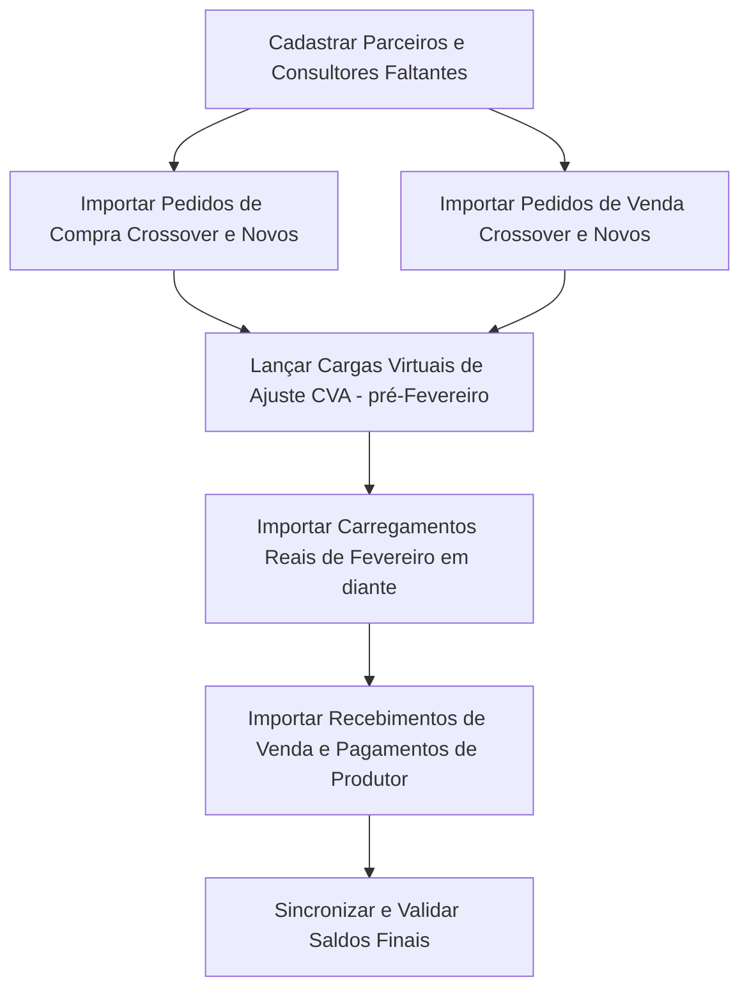

# Relatório de Análise Técnica: Saldos e Transações de Crossover (Migração AppSheet → Supabase)

Este documento apresenta uma análise técnica aprofundada sobre a viabilidade e estratégia para realizar a migração dos dados históricos do sistema legado (AppSheet Excel) para o novo banco de dados no Supabase.

O foco principal desta análise é resolver o **dilema de Crossover**: como tratar os pedidos de compra/venda criados antes de Fevereiro/2026 (Jan/2026 e 2025) que ainda tiveram movimentações de carregamento (logística) ou recebimento/pagamento (financeiro) a partir de Fevereiro/2026.

---

## 1. O Dilema de Crossover: Comparação de Estratégias

Atualmente, a regra de corte do sistema é importar apenas registros a partir de Fevereiro/2026 ($MesAno \ge 02/2026$). No entanto, existem **24 Pedidos de Venda** e **13 Pedidos de Compra** criados antes dessa data que possuem transações ativas em Fevereiro ou posterior.

Se simplesmente ignorarmos esses pedidos antigos, os carregamentos e recebimentos de Fevereiro ficarão órfãos (sem contrato para vincular), gerando erros de integridade referencial ou quebrando a lógica de relatórios e faturamentos.

Analisamos duas abordagens principais para resolver isso:

### ⚠️ Opção A: Criar Crossover como Novos Pedidos em Fevereiro/2026
Consiste em criar um novo pedido em Fevereiro/2026 com um novo código (ex: `P0226...`), ajustando o valor total do contrato apenas para a quantidade/valor que restava carregar ou receber no dia 1º de Fevereiro.
*   **Prós:** Mantém todos os registros e chaves estrangeiras estritamente dentro da faixa temporal pós-Fevereiro/2026.
*   **Contras:**
    1.  **Perda de Histórico:** O contrato original é desmembrado, perdendo a rastreabilidade da data de assinatura real e do volume total contratado.
    2.  **Incompatibilidade de Códigos:** Os códigos dos pedidos seriam alterados no novo sistema, dificultando a auditoria manual ou conciliação com relatórios antigos.
    3.  **Processo Manual e Sujeito a Erros:** Seria necessário calcular manualmente, pedido a pedido, o saldo exato restante de cada contrato para lançá-lo como "total do novo contrato" em Fevereiro.

### 🌟 Opção B (Recomendada): Manter Pedido Original + Lançamento de Ajuste de Crossover (CVA)
Consiste em importar os pedidos crossover com suas **datas e chaves originais** (ex: Janeiro/2026, Novembro/2025), mas **não importar** os carregamentos e movimentações financeiras ocorridos antes de 01/02/2026. Para equilibrar os saldos e evitar distorções de crédito/débito dos parceiros, o sistema utiliza o padrão **Crossover Virtual Adjustment (CVA)**.
*   **Como funciona o CVA:**
    1.  Calcula-se o saldo pendente de carregamento/pagamento de cada pedido crossover em 31/01/2026:
        $$\text{Net Balance}_{31/01} = \text{Carregado Antigo} - \text{Pago/Recebido Antigo}$$
    2.  Se o saldo for positivo (o cliente nos deve ou nós devemos ao produtor): Cria-se uma carga virtual de ajuste em `ops_loadings` com data `2026-01-31` no valor de $\text{Net Balance}_{31/01}$. Esta carga atua como o saldo devedor inicial do contrato.
    3.  Se o saldo for negativo (crédito/adiantamento realizado antes de Fevereiro): Lança-se um pagamento/recebimento virtual em `financial_transactions` datado em `2026-01-30`.
*   **Por que isso funciona perfeitamente no Supabase:**
    *   **Segurança de Saldos Bancários:** O Supabase calcula os saldos das contas bancárias somando apenas transações com $\text{Data} \ge \text{Data de Saldo Inicial}$. Como a data do saldo inicial no Supabase é `2026-01-31`, qualquer transação virtual datada em `2026-01-30` **é completamente ignorada no cálculo do saldo da conta**, evitando duplicar saldos de conciliação.
    *   **Controle de Títulos (Payables/Receivables):** O gatilho de atualização de títulos do Supabase soma todos os pagamentos atrelados àquele título, independente da data. Logo, a transação virtual de `2026-01-30` atualizará corretamente o `paid_amount` do título, abatendo a dívida antiga.
    *   **Relatórios 100% Exatos:** O cliente ou produtor terá seu saldo financeiro e de grãos perfeitamente conciliado no Supabase, refletindo exatamente o saldo real devedor/credor que transitou para Fevereiro.

---

## 2. Diagnóstico de Dados: Crossover Identificados no Excel

Abaixo estão listados todos os contratos crossover detectados na planilha legado que possuem movimentação ativa a partir de Fevereiro de 2026.

### 2.1 Pedidos de Venda Crossover (Clientes)
Há **24 pedidos de venda** antigos com transações em Fevereiro/2026 ou posterior. O saldo líquido em 31/01/2026 representa o que o cliente já havia carregado, mas ainda não tinha pago (saldo devedor que foi quitado a partir de Fevereiro).

| Código do Pedido | Cliente | Valor Contrato | Carregado Pré-Fev | Recebido Pré-Fev | Saldo Devedor em 31/01 | Carregado Pós-Fev | Recebido Pós-Fev | Status Final |
| :--- | :--- | :---: | :---: | :---: | :---: | :---: | :---: | :---: |
| **P0126NEW63204** | Rildo Roque Ferraz | R$ 63.000,00 | R$ 80.388,00 | R$ 0,00 | **R$ 80.388,00** | R$ 0,00 | R$ 80.388,00 | Finalizado |
| **P0126NEW65211** | Bezerros | R$ 65.500,00 | R$ 81.634,62 | R$ 0,00 | **R$ 81.634,62** | R$ 0,00 | R$ 78.750,00 | Em Aberto (R$ 2.884,62) |
| **P0126NEW76193** | Frei Damião | R$ 76.000,00 | R$ 184.755,24 | R$ 94.822,16 | **R$ 89.933,08** | R$ 193.242,92 | R$ 283.176,00 | Finalizado |
| **P0126NEW77202** | Granja Cajueiro | R$ 77.000,00 | R$ 97.083,91 | R$ 0,00 | **R$ 97.083,91** | R$ 492.492,72 | R$ 589.576,63 | Finalizado |
| **P0126NEW77203** | Nutrane | R$ 385.000,00 | R$ 288.018,50 | R$ 288.031,09 | **-R$ 12,59** (Crédito) | R$ 93.144,59 | R$ 93.132,00 | Finalizado |
| **P0126NEW77210** | São Braz Bahia | R$ 770.000,00 | R$ 789.173,00 | R$ 193.151,69 | **R$ 596.021,31** | R$ 0,00 | R$ 596.021,31 | Finalizado |
| **P0126NEW80198** | Guaraves | R$ 800.000,00 | R$ 910.932,00 | R$ 909.085,42 | **R$ 1.846,58** | R$ 0,00 | R$ 1.846,58 | Finalizado |
| **P0126NEW80200** | São Braz S/A | R$ 1.600.000,00 | R$ 1.080.865,60 | R$ 805.717,58 | **R$ 275.148,00** | R$ 148.266,40 | R$ 423.414,42 | Finalizado |
| **P0126NEW82192** | Ilario Campina Grande | R$ 82.000,00 | R$ 211.478,00 | R$ 173.300,00 | **R$ 38.178,00** | R$ 183.756,77 | R$ 221.934,77 | Finalizado |
| **P0126NEW82207** | Santa Cruz - RN | R$ 82.000,00 | R$ 102.459,00 | R$ 0,00 | **R$ 1.02.459,00** | R$ 511.589,06 | R$ 614.048,06 | Finalizado |
| **P0126NEW83201** | André Macaíbas | R$ 83.000,00 | R$ 104.563,94 | R$ 104.563,94 | **R$ 0,00** | R$ 66.580,11 | R$ 66.580,11 | Finalizado |
| **P0126NEW84195** | Diego Atacadao Racao | R$ 84.000,00 | R$ 417.316,83 | R$ 122.529,72 | **R$ 294.787,11** | R$ 208.358,22 | R$ 503.145,33 | Finalizado |
| **P0126RON76209** | Sabormill | R$ 76.500,00 | R$ 94.579,25 | R$ 93.442,69 | **R$ 1.136,56** | R$ 0,00 | R$ 1.136,56 | Finalizado |
| **P0126RON80205** | Ovos Sao Tome | R$ 80.500,00 | R$ 206.733,60 | R$ 0,00 | **R$ 2.06.733,60** | R$ 293.868,00 | R$ 500.601,60 | Finalizado |
| **P0126RON81198** | Pedro Falcão | R$ 81.000,00 | R$ 186.022,50 | R$ 94.041,00 | **R$ 91.981,50** | R$ 203.851,13 | R$ 295.832,63 | Finalizado |
| **P0126RON81206** | Ana Maria Laroche | R$ 81.000,00 | R$ 104.571,00 | R$ 0,00 | **R$ 104.571,00** | R$ 0,00 | R$ 104.571,00 | Finalizado |
| **P0525NEW93100** | Thiago Garanhuns | R$ 93.000,00 | R$ 208.826,92 | R$ 210.674,00 | **-R$ 1.847,08** (Crédito) | R$ 89.046,92 | R$ 87.199,84 | Finalizado |
| **P0625NEW79120** | Frango da Roça | R$ 79.000,00 | R$ 223.780,93 | R$ 223.780,93 | **R$ 0,00** | R$ 106.320,00 | R$ 106.320,00 | Finalizado |
| **P0725NEW76128** | Granja Canaa | R$ 76.000,00 | R$ 715.895,43 | R$ 715.895,43 | **R$ 0,00** | R$ 512.392,00 | R$ 512.392,00 | Finalizado |
| **P0925RON82143** | Sr. Pedro Vitoria | R$ 82.000,00 | R$ 271.957,60 | R$ 271.957,60 | **R$ 0,00** | R$ 158.892,44 | R$ 158.892,44 | Finalizado |
| **P1025NEW79155** | Granja Farias Macaiba | R$ 79.000,00 | R$ 884.852,93 | R$ 882.346,90 | **R$ 2.506,03** | R$ 0,00 | R$ 2.506,03 | Finalizado |
| **P1125NEW80173** | Michael Campina Gr. | R$ 80.000,00 | R$ 638.057,10 | R$ 581.733,60 | **R$ 56.323,50** | R$ 0,00 | R$ 56.323,50 | Finalizado |
| **P1125RON76167** | Clodoaldo Corretor | R$ 76.500,00 | R$ 1.087.653,28 | R$ 458.774,10 | **R$ 628.879,18** | R$ 1.385.187,62 | R$ 2.014.066,80 | Finalizado |

### 2.2 Pedidos de Compra Crossover (Produtores)
Há **13 pedidos de compra** antigos com transações em Fevereiro/2026 ou posterior. O saldo líquido em 31/01/2026 representa o que já foi carregado, mas ainda não tínhamos pago ao produtor (saldo credor do produtor) ou adiantamentos que tínhamos feito a ele (valores negativos).

| Código do Pedido | Produtor | Valor Contrato | Carregado Pré-Fev | Pago Pré-Fev | Saldo Credor em 31/01 | Carregado Pós-Fev | Pago Pós-Fev | Status Final |
| :--- | :--- | :---: | :---: | :---: | :---: | :---: | :---: | :---: |
| **10112511160** | Elizabete | R$ 531.780,88 | R$ 531.780,88 | R$ 310.330,88 | **R$ 221.450,00** | R$ 0,00 | R$ 221.450,00 | Finalizado |
| **15112511483** | Wendoly Masley | R$ 385.046,56 | R$ 385.046,56 | R$ 384.038,56 | **R$ 1.008,00** | R$ 0,00 | R$ 1.008,00 | Finalizado |
| **17112511988** | Francisco Benjamin | R$ 1.008.138,55 | R$ 1.008.138,55 | R$ 918.637,27 | **R$ 89.501,28** | R$ 0,00 | R$ 89.501,28 | Finalizado |
| **19122515132** | Mateus Pereira | R$ 751.819,88 | R$ 338.560,76 | R$ 284.411,20 | **R$ 54.149,56** | R$ 413.259,12 | R$ 467.408,68 | Finalizado |
| **26012616961** | Cardoso Aquidabã | R$ 541.739,22 | R$ 541.739,22 | R$ 471.413,36 | **R$ 70.325,86** | R$ 0,00 | R$ 70.325,86 | Finalizado |
| **26112512720** | Rodrigo Orlando | R$ 57.777,56 | R$ 57.777,56 | R$ 59.777,71 | **-R$ 2.000,15** (Adiantado) | R$ 0,00 | -R$ 2.000,15 | Finalizado |
| **27012617167** | Elquia | R$ 621.112,39 | R$ 621.112,36 | R$ 474.924,42 | **R$ 146.187,94** | R$ 0,00 | R$ 146.187,97 | Finalizado |
| **27012617262** | Francisco Benjamin | R$ 500.523,50 | R$ 500.523,50 | R$ 462.810,63 | **R$ 37.712,87** | R$ 0,00 | R$ 37.712,87 | Finalizado |
| **2702253034** | Ze Maia | R$ 182.994,74 | R$ 182.994,74 | R$ 192.124,84 | **-R$ 9.130,11** (Adiantado) | R$ 0,00 | -R$ 9.130,10 | Finalizado |
| **28012617314** | Izau PDF | R$ 556.908,10 | R$ 556.908,10 | R$ 206.580,00 | **R$ 350.328,10** | R$ 0,00 | R$ 350.328,10 | Finalizado |
| **2901261747** | Ramon | R$ 469.879,32 | R$ 0,00 | R$ 105.302,03 | **-R$ 105.302,03** (Adiantado)| R$ 469.879,32 | R$ 364.577,29 | Finalizado |
| **3006256539** | Irineu/Suporte | R$ 5.752.116,57 | R$ 5.752.116,59 | R$ 5.714.366,74| **R$ 37.749,85** | R$ 0,00 | R$ 37.749,83 | Finalizado |
| **404255072** | Gabriel Balsas/Irineu | R$ 0,00 | R$ 0,00 | R$ 319.450,00 | **-R$ 319.450,00** (Adiantado)| R$ 0,00 | -R$ 193.000,00| Em Aberto |

---

## 3. Mapeamento de Entidades (De/Para) e Status de Cadastro

Cruzando os nomes dos clientes e produtores dos contratos crossover (origem Excel) com os registros ativos na tabela `parceiros_parceiros` do Supabase, obtivemos o seguinte diagnóstico:

### 3.1 Clientes (Sales)
| Nome no Excel | ID Supabase | Nome no Supabase | Status | Ação Necessária |
| :--- | :--- | :--- | :---: | :--- |
| **Ana Maria Laroche** | — | — | ❌ Não Encontrado | Cadastrar no Supabase antes da migração |
| **André Macaíbas** | `28e16c55-4092-4392-8cca-d21be361a73c` | ANDRE MACAIBAS | ✅ Encontrado | Usar ID existente |
| **Bezerros** | `95d1d362-36b9-5566-bd2b-9ea9ade3de95` | Bezerros | ✅ Encontrado | Usar ID existente |
| **Clodoaldo Corretor** | `9309f133-bf59-41c3-83e6-21f50efa23cc` | CLODOALDO CORRETOR | ✅ Encontrado | Usar ID existente |
| **Diego Atacadao Racao** | — | — | ❌ Não Encontrado | Cadastrar no Supabase antes da migração |
| **Frango da Roça** | `fa57017d-296b-50c9-a7cb-460afec4cd87` | Frango Dourado | ⚠️ Nome Próximo | Confirmar se Frango da Roça = Frango Dourado |
| **Frei Damião** | — | — | ❌ Não Encontrado | Cadastrar no Supabase antes da migração |
| **Granja Cajueiro** | — | — | ❌ Não Encontrado | Cadastrar no Supabase antes da migração |
| **Granja Canaa** | `c54704ec-f808-5d7f-88ca-6c60f10eaf2b` | Granja Canaa | ✅ Encontrado | Usar ID existente |
| **Granja Farias Macaiba** | `bb177034-e7a3-4ffb-ae9a-a1d8ddff956e` | GRANJA FARIA S.A. | ⚠️ Nome Próximo | Usar ID existente |
| **Guaraves** | `3c2f544d-3617-4620-9ace-57189dd72e6b` | GUARAVES GUARABIRA AVES LTDA | ⚠️ Nome Próximo | Usar ID existente |
| **Ilario Campina Grande** | `d909c815-7acf-4942-a766-0f8e145e0a0e` | ILARIO CAMPINA GRANDE | ✅ Encontrado | Usar ID existente |
| **Michael Campina Grande** | `e9b13d2e-4377-567a-85ee-d42913ba13ee` | Michael Campina Grande | ✅ Encontrado | Usar ID existente |
| **Nutrane** | `6703b5c9-22c2-412e-98a0-95302c01e4a9` | NUTRANE NUTRICAO ANIMAL LTDA | ⚠️ Nome Próximo | Usar ID existente |
| **Ovos Sao Tome** | `37942c07-ef87-41ae-a6a5-721471445a97` | OVOS SAO TOME LTDA | ✅ Encontrado | Usar ID existente |
| **Pedro Falcão** | — | — | ❌ Não Encontrado | Cadastrar no Supabase antes da migração |
| **Rildo Roque Ferraz** | `898ef249-cf33-473c-abf2-6bffa4057ca4` | RILDO R FERRAZ LTDA | ✅ Encontrado | Usar ID existente |
| **Sabormill** | — | — | ❌ Não Encontrado | Cadastrar no Supabase antes da migração |
| **Santa Cruz - RN** | — | — | ❌ Não Encontrado | Cadastrar no Supabase antes da migração |
| **Sr. Pedro Vitoria** | `34532f0c-8557-5a7f-aafd-d36c2cf6cb70` | Sr. Pedro Vitoria | ✅ Encontrado | Usar ID existente |
| **São Braz Bahia** | — | — | ❌ Não Encontrado | Cadastrar no Supabase antes da migração |
| **São Braz S/A** | `9d24a374-5761-4238-b9b4-c029c8d630bc` | SAO BRAZ S/A IND. E COM. | ✅ Encontrado | Usar ID existente |
| **Thiago Garanhuns** | `d5e139a3-c0e8-5a2f-8dba-99aaf3dbd9b1` | João Garanhus | ⚠️ Nome Próximo | Confirmar se Thiago Garanhuns = João Garanhus |

### 3.2 Produtores (Purchase)
| Nome no Excel | ID Supabase | Nome no Supabase | Status | Ação Necessária |
| :--- | :--- | :--- | :---: | :--- |
| **Cardoso Aquidabã** | — | — | ❌ Não Encontrado | Cadastrar no Supabase antes da migração |
| **Elizabete** | — | — | ❌ Não Encontrado | Cadastrar no Supabase antes da migração |
| **Elquia** | `d3ca6853-38b1-4aed-8b24-babfeca85914` | ELQUIA LEM | ✅ Encontrado | Usar ID existente |
| **Francisco Benjamin** | — | — | ❌ Não Encontrado | Cadastrar no Supabase antes da migração |
| **Gabriel Balsas/Irineu** | — | — | ❌ Não Encontrado | Cadastrar no Supabase antes da migração |
| **Irineu/Suporte** | — | — | ❌ Não Encontrado | Cadastrar no Supabase antes da migração |
| **Izau PDF** | — | — | ❌ Não Encontrado | Cadastrar no Supabase antes da migração |
| **Mateus Pereira** | — | — | ❌ Não Encontrado | Cadastrar no Supabase antes da migração |
| **Ramon** | — | — | ❌ Não Encontrado | Cadastrar no Supabase antes da migração |
| **Rodrigo Orlando** | — | — | ❌ Não Encontrado | Cadastrar no Supabase antes da migração |
| **Wendoly Masley** | `b59fbeeb-aafc-4b80-9e8f-c861439f2c0c` | WENDOLY MASLEY | ✅ Encontrado | Usar ID existente |
| **Ze Maia** | `6261cf40-d5ef-5cea-89a3-94bd1fe96437` | Ze Maia | ✅ Encontrado | Usar ID existente |

### 3.3 Consultores
A coluna `Consultor` da planilha de vendas possui 3 nomes de consultores vinculados:
1.  **Newton Porto:** ✅ Cadastrado no Supabase (`9988d0a0-5e6c-54d6-9060-50011f3b62ee`).
2.  **Wendoly Masley:** ✅ Cadastrado no Supabase (`b59fbeeb-aafc-4b80-9e8f-c861439f2c0c`).
3.  **Ronaldo Silva:** ❌ **Não Encontrado** no Supabase. É preciso cadastrá-lo para que as vendas comissionadas dele possam ser atribuídas.

---

## 4. Estado Atual do Supabase (Destino)

Para fins de conformidade e conciliação, mapeamos o estado financeiro e de transações já existentes no Supabase:

### 4.1 Saldos Atuais das Contas Bancárias (Sicredi, C6, Bradesco, etc.)
| Conta Bancária | ID da Conta | Tipo | Saldo Atual no Supabase |
| :--- | :--- | :---: | :---: |
| **Sicredi** | `9aaf4fa5-0622-4220-a013-b5632d78b51a` | bank | **R$ 632.098,36** |
| **Anhanguera** | `6ff9f7ad-b836-4ecd-aef6-08768406dae8` | bank | **R$ 326.510,43** |
| **Bradesco** | `8ddee587-141f-418e-9175-a2ad3838061d` | bank | **R$ 57.137,63** |
| **Banco C6** | `f035dccb-66a3-4bb3-9e07-91f5f7f96acb` | bank | **-R$ 29.175,33** |
| **Santiago** | `b0c57b8d-1be5-4bec-b3ef-e156ac715211` | bank | **-R$ 0,08** |
| Outras Contas (BB, Terceiros) | — | bank | R$ 0,00 |

### 4.2 Lançamentos Já Existentes de Fevereiro/2026 em Diante
*   **Contratos e Pedidos:** Há **19 Pedidos de Venda** e **3 Pedidos de Compra** futuros/atuais já registrados.
*   **Carregamentos:** Há **0 carregamentos** (`ops_loadings`) registrados na base.
*   **Despesas Operacionais:** Já existem **77 despesas** cadastradas em `financial_entries` e **78 pagamentos (debitos)** em `financial_transactions` correspondentes a despesas já pagas de Fevereiro/2026 em diante.
*   **Saldos Iniciais:** Os saldos iniciais de cada conta bancária foram implantados com a data `2026-01-31`.

### 4.3 Lançamentos de Janeiro/2026 e Ajustes de Implantação Existentes

Identificamos no Supabase que as contas bancárias foram perfeitamente conciliadas para o dia 1º de Fevereiro utilizando a conta de compensação de **"Implantação"** e a criação de **11 empréstimos (loans)** datados em `2026-01-31`. 

Esses empréstimos representam os saldos globais devedores e credores do sistema legado:
*   **Créditos de Implantação (Entrada de Capital / Passivos):**
    *   `IMPLANTACAO PRODUTOR` (`taken` - a pagar): **R$ 698.981,19**
    *   `IMPLANTACAO FRETE` (`taken` - a pagar): **R$ 53.043,10**
    *   `TIO PATINHAS` (`taken` - a pagar): **R$ 350.842,00**
*   **Débitos de Implantação (Saída de Capital / Ativos):**
    *   `IMPLANTACAO RECEBIMENTO PENDENTE` (`granted` - a receber): **R$ 2.825.913,84**
    *   `IMPLANTACAO BRANCO CARRO` (`granted` - a receber): **R$ 98.521,20**
    *   `implantacao gabriel balsas` (`granted` - a receber): **R$ 126.450,00**
    *   `implantacao ernesto` (`granted` - a receber): **R$ 30.694,96**
    *   `implantacao carlos henrique som` (`granted` - a receber): **R$ 15.100,00**
    *   `implantacao juranda` (`granted` - a receber): **R$ 15.944,00**
    *   `implantacao sw4` (`granted` - a receber): **R$ 7.000,00**
    *   `IMPLANTACAO BRANCO` (`granted` - a receber): **R$ 4.115,20** (Marcado como pago)
    *   `ADIANTAMENTO FRETE` (Lançado diretamente como transação de débito na conta Implantação): **R$ 337.013,45**

#### O Mismatch do Razão Auxiliar (Sub-ledgers)
A conta de "Implantação" foi zerada com precisão matemática porque o saldo inicial da conta (R$ 2.357.886,36) foi debitado/creditado pelas movimentações acima. 

No entanto, estes empréstimos foram cadastrados de forma **genérica** (`lender_id = NULL`), ou seja, o banco de dados não sabe quais parceiros (clientes ou produtores) devem esses valores.
*   **O Problema com os Carregamentos/Recebimentos Reais:** Se importarmos os pedidos crossover e registrarmos os recebimentos reais de Fevereiro em diante atrelados às vendas do cliente (ex: Clodoaldo pagando R$ 2,01M), a conta bancária Sicredi subirá corretamente, mas:
    1.  O cliente Clodoaldo ficará com um **saldo credor de R$ 628k** (overpaid) na sua ficha, pois o sistema não sabe que ele tinha uma dívida anterior de R$ 628k.
    2.  O empréstimo genérico `IMPLANTACAO RECEBIMENTO PENDENTE` de R$ 2,82M **ficará em aberto para sempre**, pois as baixas estarão vinculadas às vendas dos parceiros, e não a esse empréstimo.

#### A Solução de Vinculação e Compensação
Para harmonizar os carregamentos e conciliar os saldos sem duplicar ativos:
1.  **Individualizar os Saldos de Crossover:** Para cada pedido crossover que possui saldo ativo em `31/01/2026`, nós criamos o título financeiro (`financial_entries`) correspondente a essa parcela de transição, vinculada diretamente ao parceiro e ao pedido correto.
2.  **Abater do Empréstimo Genérico:** O saldo total do empréstimo genérico `IMPLANTACAO RECEBIMENTO PENDENTE` (R$ 2.825.913,84) deve ser reduzido pelo somatório dos saldos individuais criados para os clientes de crossover (R$ 2.547.772,31), sobrando apenas R$ 278.141,53 (relativo a clientes que possuem dívidas antigas, mas não movimentaram o sistema em Fevereiro/2026).
3.  **Abater do Empréstimo de Produtores:** O empréstimo genérico `IMPLANTACAO PRODUTOR` (R$ 698.981,19) será individualizado para os produtores crossover (como *Mateus Pereira*, *Wendoly Masley*, *Elquia*, etc.), reduzindo a parcela genérica restante.

Dessa forma, os saldos das contas bancárias continuam **100% corretos**, e as contas dos parceiros e dos contratos ficam **perfeitamente integradas**.

### 4.4 Como Tratar os Carregamentos Anteriores (Janeiro e 2025)

Para os carregamentos que ocorreram antes de Fevereiro/2026 nos pedidos crossover, temos duas alternativas de migração:

#### Alternativa 1: Carga Virtual Consolidada de Saldo
*   **Como funciona:** Não importamos os carregamentos individuais de Janeiro. Lançamos uma única carga fictícia em `31/01/2026` com a descrição "Saldo de Carregamento Implantação", contendo o valor líquido devido em 31/01 (ex: R$ 294.787,11 para Diego Atacadão).
*   **Prós:** Menor volume de registros inseridos no banco.
*   **Contras:** Perde-se todo o histórico físico logístico de Janeiro (pesos, placas, motoristas). Se o cliente questionar um romaneio específico de Janeiro que foi pago em Fevereiro, as informações detalhadas não estarão no Supabase.

#### Alternativa 2: Importação Detalhada das Cargas + Reconciliação Virtual (Recomendada)
*   **Como funciona:** Importamos **todos** os carregamentos reais de Janeiro pertencentes a esses pedidos crossover, com suas placas, motoristas, pesos e datas reais de Janeiro.
*   **Como equilibrar o financeiro:** Para cada carga de Janeiro importada, o trigger do Supabase criará automaticamente um contas a receber/pagar. Para quitar a fatia de Janeiro (que já foi paga no sistema antigo), o script de migração importará os recebimentos/pagamentos correspondentes de Janeiro e os registrará como transações virtuais em `financial_transactions` datadas em **`2026-01-30`**.
*   **Por que é 100% seguro para os saldos:**
    *   Como a data dessas transações compensatórias (`2026-01-30`) é anterior à data do saldo inicial (`2026-01-31`), a trigger `trg_financial_transactions_update_account_balance` **não as soma no saldo da conta bancária**. O saldo das suas contas Sicredi, Bradesco, etc., permanece intocado e exato.
    *   Contudo, a trigger `trg_financial_transactions_sync_entry` **soma** essas transações virtuais no `paid_amount` (valor pago) do título financeiro da venda.
    *   **Resultado:** O título de Janeiro fica marcado como "pago/liquidado" no Supabase, a ficha do cliente fica perfeitamente correta (com o histórico de todas as cargas que ele levou), o contrato mostra o volume de entrega real acumulado (Jan+Fev) e o saldo do banco não sofre nenhuma alteração.

---

## 5. Plano de Execução da Migração (Etapas e Ordem das Cargas)

Para executar a importação com segurança e de forma autônoma (utilizando o Supabase MCP), o plano seguirá uma ordem estrita de dependências:

### ETAPA A: Cadastros Básicos (Parceiros e Consultores)
*   **Meta:** Criar os parceiros e consultores identificados no **Item 3** que estão ausentes.
*   **Regra:** Não criar cadastros duplicados para os parceiros identificados como `✅ Match Found`.
*   **Ação MCP:** Utilizar `execute_sql` para inserir os parceiros faltantes diretamente no schema `public.parceiros_parceiros`.

### ETAPA B: Pedidos de Compra e Venda (Crossover + Novos)
*   **Meta:** Importar todos os pedidos com data $\ge 02/2026$, além dos **37 pedidos crossover** antigos identificados no **Item 2**.
*   **Chaves:** Mapear a coluna `NpedidoVenda` e `NPedidoCompra` para `legacy_id` no Supabase (usado para junção e rastreamento).

### ETAPA C: CVA - Lançamentos Virtuais de Ajuste (Data de corte: 31/01/2026)
*   **Meta:** Para cada um dos 37 contratos crossover, inserir a carga virtual em `ops_loadings` com data `2026-01-31` no valor do saldo devedor do cliente/produtor, ou o pagamento virtual em `financial_transactions` com data `2026-01-30` no valor do adiantamento.
*   **Impacto:** Isso equilibrará os saldos contratuais dinâmicos do Supabase instantaneamente, sem alterar os saldos das contas bancárias de Fevereiro.

### ETAPA D: Carregamentos Reais (A partir de 01/02/2026)
*   **Meta:** Importar os carregamentos de grãos reais da aba `CarrinhoFretes` com data $\ge 02/2026$.
*   **Gatilhos:** A inserção destas cargas irá acionar automaticamente os triggers de recálculo financeiro (`rpc_ops_sales_rebuild_financial_v1` e `rpc_ops_purchase_rebuild_financial_v1`), gerando os títulos a pagar/receber no Supabase.

### ETAPA E: Recebimentos e Pagamentos Reais (A partir de 01/02/2026)
*   **Meta:** Importar as movimentações bancárias reais das abas `RecebimentoVenda` e `PagProdutor` com data $\ge 02/2026$.
*   **Junção:** Ligar cada transação ao ID do título financeiro correspondente (gerado no passo anterior pela inserção das cargas).

---

## 6. Conclusão e Resposta ao Usuário

A análise de dados prova que **a migração mantendo as datas originais e códigos dos pedidos (Opção B) é 100% possível, viável e muito superior à Opção A**.

Respondendo diretamente às suas perguntas:

1.  **"então seria melhor pegar esses pedido, criar como novo em 2026 mes 02, e lançar somente o carregamento depois desse mes? e ai sim lançar os recebimentos?"**
    *   *Resposta:* **Não.** Se você fizer isso, as baixas e recebimentos que você lançar em Fevereiro (que pagam as cargas de Janeiro) ficarão com valores incompatíveis, gerando créditos falsos (overpayment) e distorcendo o fluxo de caixa, a menos que você dividisse manualmente os recebimentos em partes, o que geraria um enorme retrabalho e inconsistência.
2.  **"vou criar o pedido com a data certa que foi criado que seria ano anterior, e lanço o carregamento normalmente com a data do mes 02, e os recebimentos vai dar certo né isso?"**
    *   *Resposta:* **Sim, vai dar certo, desde que apliquemos a técnica CVA (Crossover Virtual Adjustment)**. Criando o pedido com a data original (ano anterior) e lançando as movimentações normalmente a partir de Fevereiro, o sistema se comportará de forma integrada. O único cuidado crítico é lançar os saldos devedores/credores de transição como "Cargas/Pagamentos Virtuais" em `2026-01-31` e `2026-01-30` respectivamente, conforme detalhado no **Item 1.2**. Isso garante que os saldos contratuais batam perfeitamente e as contas bancárias continuem com a reconciliação correta.

### Próximos Passos
Esta análise está concluída e salva no arquivo do sistema. Para prosseguir com segurança, a ordem de ações recomendada é:
1.  **Aprovação deste plano** e estratégia de CVA para os contratos crossover.
2.  **Autorização para cadastrar os parceiros faltantes** identificados no Item 3.
3.  **Desenvolvimento do script automatizado de importação** aplicando o CVA para validação de Dry-Run antes do commit final no Supabase.
