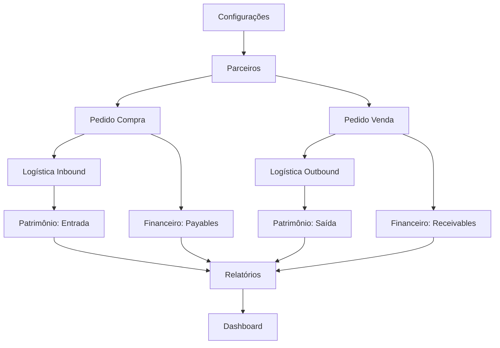

# 🎯 PLANO DE MIGRAÇÃO SUPABASE - VERSÃO 2.0
## Análise Detalhada com 10 Etapas + Scripts de Teste

**Data:** 25 de janeiro de 2026  
**Status:** Fase 1 ✅ Concluída | Fase 2 ✅ Parcial (Parceiros/Motoristas/Veículos)  
**Próxima:** Fase 3 - Pedido de Compra

---

## 📊 VISÃO GERAL DO SISTEMA

### Fluxo Completo de Negócio:
```
┌─────────────────────────────────────────────────────────────────────┐
│                    1. CONFIGURAÇÕES (BASE)                          │
│  Empresa | Contas Bancárias | Tipos | Categorias | Sócios          │
└──────────────────────┬──────────────────────────────────────────────┘
                       ↓
┌─────────────────────────────────────────────────────────────────────┐
│                    2. PARCEIROS (CADASTRO)                          │
│  Fornecedores | Clientes | Transportadoras | Motoristas | Veículos │
└──────┬───────────────────────────────────────────────────────┬──────┘
       ↓                                                       ↓
┌──────────────────────┐                           ┌──────────────────────┐
│  3. PEDIDO COMPRA    │                           │  4. PEDIDO VENDA     │
│  • Itens             │                           │  • Itens             │
│  • Despesas Extras   │                           │  • Descontos         │
│  • Conferência       │                           │  • Entregas          │
└─────────┬────────────┘                           └──────────┬───────────┘
          ↓                                                   ↓
┌─────────────────────────────────────────────────────────────────────┐
│                    5. LOGÍSTICA/CARREGAMENTO                        │
│  Inbound (Compra) ← loadings → Outbound (Venda)                    │
│  Vincula: Veículo + Motorista + Origem + Destino                   │
└──────────────────────┬──────────────────────────────────────────────┘
                       ↓
┌─────────────────────────────────────────────────────────────────────┐
│                    6. PATRIMÔNIO (ESTOQUE)                          │
│  Movimentações: Entrada (Compra) | Saída (Venda) | Ajustes         │
└──────────────────────┬──────────────────────────────────────────────┘
                       ↓
┌─────────────────────────────────────────────────────────────────────┐
│                    7. FINANCEIRO PRINCIPAL                          │
│  Contas a Pagar (Compra) | Contas a Receber (Venda)                │
│  Empréstimos | Adiantamentos | Histórico                           │
└──────────────────────┬──────────────────────────────────────────────┘
                       ↓
┌─────────────────────────────────────────────────────────────────────┐
│                    8. RELATÓRIOS & ANALYTICS                        │
│  Fluxo de Caixa | DRE | Balancete | Dashboard                      │
└─────────────────────────────────────────────────────────────────────┘
```

---

## 🎯 ETAPAS DE IMPLEMENTAÇÃO (10 FASES)

---

### **ETAPA 1: CONFIGURAÇÕES** ✅ **CONCLUÍDA**

#### 📋 Tabelas Criadas:
- ✅ `companies` - Dados da empresa
- ✅ `ufs` - Estados (Unidades Federativas)
- ✅ `cities` - Cidades vinculadas a UFs
- ✅ `partner_types` - Tipos de parceiros (PF, PJ, Transportadora, etc)
- ✅ `product_types` - Tipos de produtos (Milho, Soja, etc)
- ✅ `contas_bancarias` - Contas bancárias da empresa
- ✅ `expense_types` - Tipos de despesas
- ✅ `expense_categories` - Categorias de despesas (vinculadas a tipos)
- ✅ `initial_balances` - Saldos iniciais das contas
- ✅ `shareholders` - Sócios da empresa
- ✅ `shareholder_transactions` - Movimentações financeiras dos sócios
- ✅ `watermarks` - Marcas d'água para PDFs

#### 🔗 Relacionamentos:
```
companies (1)
    ↓
contas_bancarias (N)
    ↓
initial_balances (N)

ufs (1)
    ↓
cities (N)

expense_types (1)
    ↓
expense_categories (N)

shareholders (1)
    ↓
shareholder_transactions (N)
```

#### ✅ Checklist:
- [x] RLS configurado para multi-tenancy
- [x] Realtime ativo em todas as tabelas
- [x] Services com `subscribe()` implementados
- [x] Componentes React conectados com subscriptions
- [x] Cross-tab sync funcionando

#### 📝 Lições Aprendidas:
- UUID generator fallback necessário para navegadores
- Storage events essenciais para sincronização entre abas
- Subscribe pattern elimina polling manual

---

### **ETAPA 2: PARCEIROS & FROTA** ✅ **PARCIALMENTE CONCLUÍDA**

#### 📋 Tabelas Criadas:
- ✅ `partners` - Cadastro de parceiros (fornecedores, clientes, transportadoras)
- ✅ `drivers` - Motoristas vinculados a parceiros
- ✅ `vehicles` - Veículos próprios ou de terceiros

#### 🔗 Relacionamentos:
```
partners (1)
    ├── drivers (N) - partner_id
    └── vehicles (N) - owner_partner_id (se terceiro)

partner_types (1)
    ↓
partners (N) - partner_type_id
```

#### 🐛 Bugs Encontrados & Corrigidos:
- ❌ `crypto.randomUUID()` undefined → ✅ `generateUUID()` helper
- ❌ Motoristas sem `partner_id` → ✅ ALTER TABLE executado
- ❌ Enum veículos errado → ✅ CHECK constraint atualizado
- ❌ Realtime não propagava → ✅ Subscribe pattern implementado

#### ✅ Checklist:
- [x] RLS configurado
- [x] Realtime ativo
- [x] Services com `subscribe()`
- [x] Componentes conectados
- [x] Cross-tab sync testado

#### 📝 Próximas Correções Necessárias:
- [ ] Adicionar tabela `partner_contacts` (contatos dos parceiros)
- [ ] Adicionar tabela `partner_addresses` (endereços múltiplos)
- [ ] Vincular `partners.address_id` principal

---

### **ETAPA 3: PEDIDO DE COMPRA** 🔄 **PRÓXIMA**

#### 📋 Tabelas a Criar (4 total):

##### 1. `purchase_orders` (Cabeçalho do Pedido)
```sql
CREATE TABLE purchase_orders (
  id UUID PRIMARY KEY DEFAULT gen_random_uuid(),
  number TEXT NOT NULL UNIQUE, -- "PC-2026-001"
  partner_id UUID NOT NULL REFERENCES partners(id),
  date DATE NOT NULL,
  expected_date DATE,
  status TEXT NOT NULL CHECK (status IN ('pending', 'approved', 'received', 'cancelled')),
  total_value DECIMAL(15,2) NOT NULL DEFAULT 0,
  received_value DECIMAL(15,2) NOT NULL DEFAULT 0,
  notes TEXT,
  company_id UUID REFERENCES companies(id),
  created_by UUID REFERENCES auth.users(id),
  created_at TIMESTAMPTZ DEFAULT NOW(),
  updated_at TIMESTAMPTZ DEFAULT NOW()
);

CREATE INDEX idx_purchase_orders_partner ON purchase_orders(partner_id);
CREATE INDEX idx_purchase_orders_company ON purchase_orders(company_id);
CREATE INDEX idx_purchase_orders_status ON purchase_orders(status);
CREATE INDEX idx_purchase_orders_date ON purchase_orders(date);
```

##### 2. `purchase_order_items` (Itens/Produtos do Pedido)
```sql
CREATE TABLE purchase_order_items (
  id UUID PRIMARY KEY DEFAULT gen_random_uuid(),
  purchase_order_id UUID NOT NULL REFERENCES purchase_orders(id) ON DELETE CASCADE,
  product_type_id UUID NOT NULL REFERENCES product_types(id),
  quantity DECIMAL(15,3) NOT NULL,
  unit_price DECIMAL(15,2) NOT NULL,
  subtotal DECIMAL(15,2) GENERATED ALWAYS AS (quantity * unit_price) STORED,
  received_quantity DECIMAL(15,3) DEFAULT 0,
  notes TEXT,
  created_at TIMESTAMPTZ DEFAULT NOW()
);

CREATE INDEX idx_purchase_items_order ON purchase_order_items(purchase_order_id);
CREATE INDEX idx_purchase_items_product ON purchase_order_items(product_type_id);
```

##### 3. `purchase_receipts` (Conferência de Entrada)
```sql
CREATE TABLE purchase_receipts (
  id UUID PRIMARY KEY DEFAULT gen_random_uuid(),
  purchase_order_id UUID NOT NULL REFERENCES purchase_orders(id),
  receipt_date DATE NOT NULL,
  received_quantity DECIMAL(15,3) NOT NULL,
  notes TEXT,
  received_by TEXT, -- Nome do usuário que conferiu
  created_at TIMESTAMPTZ DEFAULT NOW()
);

CREATE INDEX idx_purchase_receipts_order ON purchase_receipts(purchase_order_id);
CREATE INDEX idx_purchase_receipts_date ON purchase_receipts(receipt_date);
```

##### 4. `purchase_expenses` (Despesas Extras - NOVA!)
```sql
CREATE TABLE purchase_expenses (
  id UUID PRIMARY KEY DEFAULT gen_random_uuid(),
  purchase_order_id UUID NOT NULL REFERENCES purchase_orders(id) ON DELETE CASCADE,
  expense_category_id UUID NOT NULL REFERENCES expense_categories(id),
  description TEXT NOT NULL, -- Ex: "Frete até armazém", "Taxa de descarga"
  value DECIMAL(15,2) NOT NULL,
  expense_date DATE NOT NULL,
  paid BOOLEAN DEFAULT false,
  payment_date DATE,
  bank_account_id UUID REFERENCES contas_bancarias(id),
  notes TEXT,
  company_id UUID REFERENCES companies(id),
  created_at TIMESTAMPTZ DEFAULT NOW(),
  updated_at TIMESTAMPTZ DEFAULT NOW()
);

CREATE INDEX idx_purchase_expenses_order ON purchase_expenses(purchase_order_id);
CREATE INDEX idx_purchase_expenses_category ON purchase_expenses(expense_category_id);
CREATE INDEX idx_purchase_expenses_paid ON purchase_expenses(paid);
```

#### 🔗 Relacionamentos:
```
purchase_orders (1)
    ├── purchase_order_items (N)
    ├── purchase_receipts (N)
    └── purchase_expenses (N) ← NOVA TABELA!
```

#### 🎯 Regras de Negócio:
1. **Total do Pedido:**
   ```typescript
   total_value = SUM(purchase_order_items.subtotal) + SUM(purchase_expenses.value)
   ```

2. **Status do Pedido:**
   - `pending`: Aguardando aprovação
   - `approved`: Aprovado, aguardando recebimento
   - `received`: Totalmente recebido
   - `cancelled`: Cancelado

3. **Conferência:**
   - `received_quantity` ≤ `quantity` (por item)
   - Status muda para `received` quando SUM(received_quantity) = SUM(quantity)

4. **Despesas Extras:**
   - Podem ser adicionadas antes ou depois do recebimento
   - Afetam o custo total do pedido
   - Geram movimento no financeiro quando `paid = true`

#### 🔗 Integrações com Outros Módulos:

##### → Logística (Etapa 5):
```sql
-- Criar carregamento vinculado ao pedido
INSERT INTO loadings (
  type, 
  purchase_order_id, 
  vehicle_id, 
  driver_id,
  ...
) VALUES ('inbound', purchase_order.id, ...);
```

##### → Patrimônio (Etapa 6):
```sql
-- Ao receber (receipt), criar movimento de entrada
INSERT INTO inventory_movements (
  movement_type,
  reference_type,
  reference_id,
  product_type_id,
  quantity,
  ...
) VALUES ('inbound', 'purchase_order', purchase_order.id, ...);
```

##### → Financeiro (Etapa 7):
```sql
-- Quando aprovado, criar conta a pagar
INSERT INTO payables (
  purchase_order_id,
  partner_id,
  amount,
  due_date,
  status
) VALUES (
  purchase_order.id,
  purchase_order.partner_id,
  purchase_order.total_value, -- produtos + despesas
  purchase_order.expected_date + INTERVAL '30 days',
  'pending'
);
```

#### 📝 Script de Teste (Etapa 3):
```sql
-- 1. Criar pedido
INSERT INTO purchase_orders (number, partner_id, date, status, company_id)
VALUES ('PC-2026-001', '...', '2026-01-25', 'pending', '...');

-- 2. Adicionar item (milho)
INSERT INTO purchase_order_items (purchase_order_id, product_type_id, quantity, unit_price)
VALUES ('...', '...', 1000, 50.00); -- 1000kg a R$50/kg = R$50.000

-- 3. Adicionar despesa extra (frete)
INSERT INTO purchase_expenses (purchase_order_id, expense_category_id, description, value, expense_date)
VALUES ('...', '...', 'Frete até armazém', 2000.00, '2026-01-25');

-- 4. Verificar total
SELECT 
  po.number,
  po.total_value AS total_produtos,
  COALESCE(SUM(pe.value), 0) AS total_despesas,
  po.total_value + COALESCE(SUM(pe.value), 0) AS total_geral
FROM purchase_orders po
LEFT JOIN purchase_expenses pe ON pe.purchase_order_id = po.id
WHERE po.number = 'PC-2026-001'
GROUP BY po.id;

-- Resultado esperado: R$52.000 (50k produtos + 2k frete)

-- 5. Aprovar pedido
UPDATE purchase_orders SET status = 'approved' WHERE number = 'PC-2026-001';

-- 6. Conferir recebimento
INSERT INTO purchase_receipts (purchase_order_id, receipt_date, received_quantity, received_by)
VALUES ('...', '2026-01-30', 1000, 'João Silva');

-- 7. Atualizar item
UPDATE purchase_order_items 
SET received_quantity = 1000 
WHERE purchase_order_id = '...';

-- 8. Atualizar status do pedido
UPDATE purchase_orders 
SET status = 'received', received_value = 52000.00
WHERE number = 'PC-2026-001';

-- 9. Verificar integridade
SELECT 
  po.number,
  po.status,
  SUM(poi.quantity) AS qty_ordered,
  SUM(poi.received_quantity) AS qty_received,
  (SUM(poi.quantity) = SUM(poi.received_quantity)) AS fully_received
FROM purchase_orders po
JOIN purchase_order_items poi ON poi.purchase_order_id = po.id
WHERE po.number = 'PC-2026-001'
GROUP BY po.id;
```

#### ✅ Checklist Etapa 3:
- [ ] Criar 4 tabelas no Supabase
- [ ] Configurar RLS (policies para SELECT/INSERT/UPDATE/DELETE)
- [ ] Ativar Realtime nas 4 tabelas
- [ ] Criar `purchaseService.ts` com CRUD + subscribe()
- [ ] Criar `PurchaseOrderModule.tsx` com subscriptions
- [ ] Implementar formulário de criação de pedido
- [ ] Implementar tela de despesas extras
- [ ] Implementar conferência de recebimento
- [ ] Testar cross-tab sync
- [ ] Executar script de teste acima
- [ ] Validar integridade de dados

---

### **ETAPA 4: PEDIDO DE VENDA** 🔄

#### 📋 Tabelas a Criar (3 total):

##### 1. `sales_orders` (Cabeçalho do Pedido)
```sql
CREATE TABLE sales_orders (
  id UUID PRIMARY KEY DEFAULT gen_random_uuid(),
  number TEXT NOT NULL UNIQUE, -- "PV-2026-001"
  partner_id UUID NOT NULL REFERENCES partners(id),
  date DATE NOT NULL,
  expected_delivery_date DATE,
  status TEXT NOT NULL CHECK (status IN ('pending', 'approved', 'shipped', 'delivered', 'cancelled')),
  total_value DECIMAL(15,2) NOT NULL DEFAULT 0,
  shipped_value DECIMAL(15,2) NOT NULL DEFAULT 0,
  discount DECIMAL(15,2) DEFAULT 0,
  notes TEXT,
  company_id UUID REFERENCES companies(id),
  created_by UUID REFERENCES auth.users(id),
  created_at TIMESTAMPTZ DEFAULT NOW(),
  updated_at TIMESTAMPTZ DEFAULT NOW()
);

CREATE INDEX idx_sales_orders_partner ON sales_orders(partner_id);
CREATE INDEX idx_sales_orders_company ON sales_orders(company_id);
CREATE INDEX idx_sales_orders_status ON sales_orders(status);
CREATE INDEX idx_sales_orders_date ON sales_orders(date);
```

##### 2. `sales_order_items` (Itens/Produtos do Pedido)
```sql
CREATE TABLE sales_order_items (
  id UUID PRIMARY KEY DEFAULT gen_random_uuid(),
  sales_order_id UUID NOT NULL REFERENCES sales_orders(id) ON DELETE CASCADE,
  product_type_id UUID NOT NULL REFERENCES product_types(id),
  quantity DECIMAL(15,3) NOT NULL,
  unit_price DECIMAL(15,2) NOT NULL,
  subtotal DECIMAL(15,2) GENERATED ALWAYS AS (quantity * unit_price) STORED,
  shipped_quantity DECIMAL(15,3) DEFAULT 0,
  notes TEXT,
  created_at TIMESTAMPTZ DEFAULT NOW()
);

CREATE INDEX idx_sales_items_order ON sales_order_items(sales_order_id);
CREATE INDEX idx_sales_items_product ON sales_order_items(product_type_id);
```

##### 3. `sales_deliveries` (Confirmação de Entrega)
```sql
CREATE TABLE sales_deliveries (
  id UUID PRIMARY KEY DEFAULT gen_random_uuid(),
  sales_order_id UUID NOT NULL REFERENCES sales_orders(id),
  delivery_date DATE NOT NULL,
  shipped_quantity DECIMAL(15,3) NOT NULL,
  notes TEXT,
  delivered_by TEXT, -- Nome do responsável
  created_at TIMESTAMPTZ DEFAULT NOW()
);

CREATE INDEX idx_sales_deliveries_order ON sales_deliveries(sales_order_id);
CREATE INDEX idx_sales_deliveries_date ON sales_deliveries(delivery_date);
```

#### 🔗 Relacionamentos:
```
sales_orders (1)
    ├── sales_order_items (N)
    └── sales_deliveries (N)
```

#### 🎯 Regras de Negócio:
1. **Total da Venda:**
   ```typescript
   total_value = SUM(sales_order_items.subtotal) - discount
   ```

2. **Status do Pedido:**
   - `pending`: Aguardando aprovação
   - `approved`: Aprovado, aguardando envio
   - `shipped`: Em trânsito
   - `delivered`: Entregue ao cliente
   - `cancelled`: Cancelado

3. **Entrega:**
   - `shipped_quantity` ≤ `quantity` (por item)
   - Status muda para `delivered` quando SUM(shipped_quantity) = SUM(quantity)

#### 🔗 Integrações:

##### → Logística (Etapa 5):
```sql
INSERT INTO loadings (
  type, 
  sales_order_id, 
  vehicle_id, 
  driver_id,
  ...
) VALUES ('outbound', sales_order.id, ...);
```

##### → Patrimônio (Etapa 6):
```sql
-- Ao aprovar, reservar estoque
UPDATE inventory 
SET quantity_reserved = quantity_reserved + sales_order_items.quantity
WHERE product_type_id = sales_order_items.product_type_id;

-- Ao entregar, dar baixa
INSERT INTO inventory_movements (
  movement_type,
  reference_type,
  reference_id,
  product_type_id,
  quantity,
  ...
) VALUES ('outbound', 'sales_order', sales_order.id, ...);
```

##### → Financeiro (Etapa 7):
```sql
INSERT INTO receivables (
  sales_order_id,
  partner_id,
  amount,
  due_date,
  status
) VALUES (
  sales_order.id,
  sales_order.partner_id,
  sales_order.total_value, -- com desconto
  sales_order.expected_delivery_date + INTERVAL '30 days',
  'pending'
);
```

#### 📝 Script de Teste (Etapa 4):
```sql
-- 1. Criar pedido de venda
INSERT INTO sales_orders (number, partner_id, date, status, company_id)
VALUES ('PV-2026-001', '...', '2026-01-25', 'pending', '...');

-- 2. Adicionar item (milho)
INSERT INTO sales_order_items (sales_order_id, product_type_id, quantity, unit_price)
VALUES ('...', '...', 800, 65.00); -- 800kg a R$65/kg = R$52.000

-- 3. Aplicar desconto
UPDATE sales_orders SET discount = 2000.00 WHERE number = 'PV-2026-001';
-- Total final: R$50.000

-- 4. Aprovar
UPDATE sales_orders SET status = 'approved' WHERE number = 'PV-2026-001';

-- 5. Registrar entrega
INSERT INTO sales_deliveries (sales_order_id, delivery_date, shipped_quantity, delivered_by)
VALUES ('...', '2026-02-05', 800, 'Carlos Transportes');

-- 6. Atualizar item
UPDATE sales_order_items 
SET shipped_quantity = 800 
WHERE sales_order_id = '...';

-- 7. Finalizar
UPDATE sales_orders 
SET status = 'delivered', shipped_value = 50000.00
WHERE number = 'PV-2026-001';

-- 8. Verificar
SELECT 
  so.number,
  so.status,
  SUM(soi.quantity) AS qty_ordered,
  SUM(soi.shipped_quantity) AS qty_shipped,
  so.total_value - so.discount AS total_final
FROM sales_orders so
JOIN sales_order_items soi ON soi.sales_order_id = so.id
WHERE so.number = 'PV-2026-001'
GROUP BY so.id;
```

#### ✅ Checklist Etapa 4:
- [ ] Criar 3 tabelas no Supabase
- [ ] Configurar RLS
- [ ] Ativar Realtime
- [ ] Criar `salesService.ts` com subscribe()
- [ ] Criar `SalesOrderModule.tsx`
- [ ] Implementar formulário de venda
- [ ] Implementar confirmação de entrega
- [ ] Testar cross-tab sync
- [ ] Executar script de teste

---

### **ETAPA 5: LOGÍSTICA & CARREGAMENTO** 🔄

#### 📋 Tabelas a Criar (2 novas + 2 já existentes):

##### 1. `loadings` (Carregamentos Inbound/Outbound)
```sql
CREATE TABLE loadings (
  id UUID PRIMARY KEY DEFAULT gen_random_uuid(),
  loading_number TEXT NOT NULL UNIQUE, -- "LOAD-2026-001"
  type TEXT NOT NULL CHECK (type IN ('inbound', 'outbound')),
  purchase_order_id UUID REFERENCES purchase_orders(id),
  sales_order_id UUID REFERENCES sales_orders(id),
  date DATE NOT NULL,
  vehicle_id UUID NOT NULL REFERENCES vehicles(id),
  driver_id UUID NOT NULL REFERENCES drivers(id),
  origin_city TEXT NOT NULL,
  origin_state TEXT NOT NULL,
  destination_city TEXT NOT NULL,
  destination_state TEXT NOT NULL,
  weight_kg DECIMAL(15,3) NOT NULL,
  weight_unload_kg DECIMAL(15,3),
  status TEXT NOT NULL CHECK (status IN ('pending', 'in_transit', 'unloading', 'completed', 'cancelled')),
  freight_cost DECIMAL(15,2) DEFAULT 0,
  notes TEXT,
  company_id UUID REFERENCES companies(id),
  created_at TIMESTAMPTZ DEFAULT NOW(),
  updated_at TIMESTAMPTZ DEFAULT NOW(),
  CONSTRAINT loading_reference_check CHECK (
    (purchase_order_id IS NOT NULL AND sales_order_id IS NULL) OR
    (purchase_order_id IS NULL AND sales_order_id IS NOT NULL)
  )
);

CREATE INDEX idx_loadings_type ON loadings(type);
CREATE INDEX idx_loadings_purchase ON loadings(purchase_order_id);
CREATE INDEX idx_loadings_sales ON loadings(sales_order_id);
CREATE INDEX idx_loadings_vehicle ON loadings(vehicle_id);
CREATE INDEX idx_loadings_driver ON loadings(driver_id);
CREATE INDEX idx_loadings_status ON loadings(status);
```

##### 2. `warehouse_locations` (Localizações de Armazém)
```sql
CREATE TABLE warehouse_locations (
  id UUID PRIMARY KEY DEFAULT gen_random_uuid(),
  name TEXT NOT NULL,
  zone TEXT, -- A, B, C (classificação ABC)
  city TEXT NOT NULL,
  state TEXT NOT NULL,
  capacity_kg DECIMAL(15,3),
  temperature_controlled BOOLEAN DEFAULT false,
  company_id UUID REFERENCES companies(id),
  active BOOLEAN DEFAULT true,
  created_at TIMESTAMPTZ DEFAULT NOW()
);

CREATE INDEX idx_warehouse_company ON warehouse_locations(company_id);
CREATE INDEX idx_warehouse_active ON warehouse_locations(active);
```

##### 3. ✅ `drivers` (Já Existe - Etapa 2)
##### 4. ✅ `vehicles` (Já Existe - Etapa 2)

#### 🔗 Relacionamentos:
```
loadings (1)
    ├── purchase_orders (0..1) - se inbound
    ├── sales_orders (0..1) - se outbound
    ├── vehicles (1)
    └── drivers (1)

warehouse_locations (1)
    ↓
inventory (N) - location_id (Etapa 6)
```

#### 🎯 Regras de Negócio:
1. **Tipo de Carregamento:**
   - `inbound`: Compra (purchase_order_id preenchido)
   - `outbound`: Venda (sales_order_id preenchido)

2. **Validação:**
   - Não pode ter ambos purchase_order_id E sales_order_id preenchidos
   - weight_unload_kg ≤ weight_kg
   - Motorista e veículo devem estar ativos

3. **Status:**
   - `pending` → `in_transit` → `unloading` → `completed`

#### 🔗 Integrações:

##### ← Compra (Etapa 3):
```typescript
// Criar carregamento ao aprovar pedido
if (purchase_order.status === 'approved') {
  await loadingService.create({
    type: 'inbound',
    purchase_order_id: purchase_order.id,
    vehicle_id: '...',
    driver_id: '...',
    origin_city: partner.city,
    destination_city: warehouse.city,
    weight_kg: purchase_order.total_weight
  });
}
```

##### ← Venda (Etapa 4):
```typescript
// Criar carregamento ao aprovar venda
if (sales_order.status === 'approved') {
  await loadingService.create({
    type: 'outbound',
    sales_order_id: sales_order.id,
    vehicle_id: '...',
    driver_id: '...',
    origin_city: warehouse.city,
    destination_city: customer.city,
    weight_kg: sales_order.total_weight
  });
}
```

##### → Patrimônio (Etapa 6):
```typescript
// Ao completar carregamento inbound
if (loading.type === 'inbound' && loading.status === 'completed') {
  await inventoryService.addMovement({
    movement_type: 'inbound',
    reference_type: 'loading',
    reference_id: loading.id,
    to_location_id: warehouse_default.id,
    quantity: loading.weight_unload_kg
  });
}

// Ao completar carregamento outbound
if (loading.type === 'outbound' && loading.status === 'completed') {
  await inventoryService.addMovement({
    movement_type: 'outbound',
    reference_type: 'loading',
    reference_id: loading.id,
    from_location_id: warehouse_default.id,
    quantity: loading.weight_kg
  });
}
```

#### 📝 Script de Teste (Etapa 5):
```sql
-- 1. Criar localização de armazém
INSERT INTO warehouse_locations (name, zone, city, state, capacity_kg, company_id)
VALUES ('Armazém Principal', 'A', 'Aracaju', 'SE', 500000, '...');

-- 2. Criar carregamento inbound (compra)
INSERT INTO loadings (
  loading_number, type, purchase_order_id, date,
  vehicle_id, driver_id, 
  origin_city, origin_state,
  destination_city, destination_state,
  weight_kg, status, company_id
) VALUES (
  'LOAD-2026-001', 'inbound', '...', '2026-01-26',
  '...', '...', 
  'São Luís', 'MA',
  'Aracaju', 'SE',
  1000, 'pending', '...'
);

-- 3. Atualizar status para em trânsito
UPDATE loadings SET status = 'in_transit' WHERE loading_number = 'LOAD-2026-001';

-- 4. Registrar descarga
UPDATE loadings 
SET 
  status = 'unloading',
  weight_unload_kg = 995 -- perda de 5kg
WHERE loading_number = 'LOAD-2026-001';

-- 5. Completar
UPDATE loadings SET status = 'completed' WHERE loading_number = 'LOAD-2026-001';

-- 6. Verificar integridade
SELECT 
  l.loading_number,
  l.type,
  l.status,
  l.weight_kg AS peso_carregado,
  l.weight_unload_kg AS peso_descarregado,
  l.weight_kg - l.weight_unload_kg AS perda_kg,
  po.number AS pedido_compra,
  v.plate AS veiculo,
  d.name AS motorista
FROM loadings l
LEFT JOIN purchase_orders po ON l.purchase_order_id = po.id
JOIN vehicles v ON l.vehicle_id = v.id
JOIN drivers d ON l.driver_id = d.id
WHERE l.loading_number = 'LOAD-2026-001';
```

#### ✅ Checklist Etapa 5:
- [ ] Criar 2 novas tabelas (loadings, warehouse_locations)
- [ ] Configurar RLS
- [ ] Ativar Realtime
- [ ] Criar `loadingService.ts` com subscribe()
- [ ] Criar `LogisticsModule.tsx`
- [ ] Integrar com purchase_orders
- [ ] Integrar com sales_orders
- [ ] Implementar rastreamento de status
- [ ] Testar cross-tab sync
- [ ] Executar script de teste

---

### **ETAPA 6: PATRIMÔNIO & ESTOQUE** 🔄

#### 📋 Tabelas a Criar (2 total):

##### 1. `inventory` (Saldo Atual de Estoque)
```sql
CREATE TABLE inventory (
  id UUID PRIMARY KEY DEFAULT gen_random_uuid(),
  product_type_id UUID NOT NULL REFERENCES product_types(id),
  location_id UUID NOT NULL REFERENCES warehouse_locations(id),
  quantity_on_hand DECIMAL(15,3) NOT NULL DEFAULT 0,
  quantity_reserved DECIMAL(15,3) NOT NULL DEFAULT 0,
  quantity_available DECIMAL(15,3) GENERATED ALWAYS AS (quantity_on_hand - quantity_reserved) STORED,
  last_movement_date DATE,
  company_id UUID REFERENCES companies(id),
  updated_at TIMESTAMPTZ DEFAULT NOW(),
  UNIQUE(product_type_id, location_id, company_id)
);

CREATE INDEX idx_inventory_product ON inventory(product_type_id);
CREATE INDEX idx_inventory_location ON inventory(location_id);
CREATE INDEX idx_inventory_company ON inventory(company_id);
```

##### 2. `inventory_movements` (Histórico de Movimentações)
```sql
CREATE TABLE inventory_movements (
  id UUID PRIMARY KEY DEFAULT gen_random_uuid(),
  product_type_id UUID NOT NULL REFERENCES product_types(id),
  from_location_id UUID REFERENCES warehouse_locations(id),
  to_location_id UUID REFERENCES warehouse_locations(id),
  quantity DECIMAL(15,3) NOT NULL,
  movement_type TEXT NOT NULL CHECK (movement_type IN ('inbound', 'outbound', 'transfer', 'adjustment')),
  reference_type TEXT, -- 'purchase_order', 'sales_order', 'loading', 'adjustment'
  reference_id UUID, -- ID da entidade referenciada
  movement_date DATE NOT NULL,
  notes TEXT,
  company_id UUID REFERENCES companies(id),
  created_by UUID REFERENCES auth.users(id),
  created_at TIMESTAMPTZ DEFAULT NOW()
);

CREATE INDEX idx_movements_product ON inventory_movements(product_type_id);
CREATE INDEX idx_movements_from ON inventory_movements(from_location_id);
CREATE INDEX idx_movements_to ON inventory_movements(to_location_id);
CREATE INDEX idx_movements_type ON inventory_movements(movement_type);
CREATE INDEX idx_movements_date ON inventory_movements(movement_date);
CREATE INDEX idx_movements_reference ON inventory_movements(reference_type, reference_id);
```

#### 🔗 Relacionamentos:
```
inventory (1 por produto/localização)
    ↑
inventory_movements (N) - histórico
```

#### 🎯 Regras de Negócio:
1. **Saldo Disponível:**
   ```sql
   quantity_available = quantity_on_hand - quantity_reserved
   ```

2. **Tipos de Movimento:**
   - `inbound`: Entrada (compra, recebimento)
   - `outbound`: Saída (venda, entrega)
   - `transfer`: Transferência entre localizações
   - `adjustment`: Ajuste manual de estoque

3. **Validações:**
   - `quantity_on_hand` nunca negativo
   - `quantity_reserved` ≤ `quantity_on_hand`
   - Movimento `outbound` requer estoque disponível

#### 🔗 Integrações:

##### ← Compra (Etapa 3):
```typescript
// Ao receber pedido
if (purchase_receipt.received_quantity > 0) {
  // Criar movimento de entrada
  await inventoryService.addMovement({
    product_type_id: purchase_item.product_type_id,
    to_location_id: warehouse_default.id,
    quantity: purchase_receipt.received_quantity,
    movement_type: 'inbound',
    reference_type: 'purchase_order',
    reference_id: purchase_order.id,
    movement_date: purchase_receipt.receipt_date
  });
  
  // Atualizar saldo
  await inventoryService.updateQuantity({
    product_type_id: purchase_item.product_type_id,
    location_id: warehouse_default.id,
    quantity_on_hand: current.quantity_on_hand + purchase_receipt.received_quantity
  });
}
```

##### ← Venda (Etapa 4):
```typescript
// Ao aprovar venda, reservar estoque
if (sales_order.status === 'approved') {
  await inventoryService.reserveStock({
    product_type_id: sales_item.product_type_id,
    location_id: warehouse_default.id,
    quantity_reserved: sales_item.quantity
  });
}

// Ao entregar, dar baixa
if (sales_delivery.shipped_quantity > 0) {
  // Criar movimento de saída
  await inventoryService.addMovement({
    product_type_id: sales_item.product_type_id,
    from_location_id: warehouse_default.id,
    quantity: sales_delivery.shipped_quantity,
    movement_type: 'outbound',
    reference_type: 'sales_order',
    reference_id: sales_order.id,
    movement_date: sales_delivery.delivery_date
  });
  
  // Atualizar saldo (remover reserva + reduzir on_hand)
  await inventoryService.updateQuantity({
    product_type_id: sales_item.product_type_id,
    location_id: warehouse_default.id,
    quantity_on_hand: current.quantity_on_hand - sales_delivery.shipped_quantity,
    quantity_reserved: current.quantity_reserved - sales_delivery.shipped_quantity
  });
}
```

##### ← Logística (Etapa 5):
```typescript
// Ao completar carregamento inbound
if (loading.status === 'completed' && loading.type === 'inbound') {
  await inventoryService.addMovement({
    product_type_id: loading.product_type_id,
    to_location_id: warehouse_default.id,
    quantity: loading.weight_unload_kg,
    movement_type: 'inbound',
    reference_type: 'loading',
    reference_id: loading.id,
    movement_date: new Date()
  });
}
```

#### 📝 Script de Teste (Etapa 6):
```sql
-- 1. Verificar saldo inicial (deve ser zero)
SELECT * FROM inventory 
WHERE product_type_id = '...' AND location_id = '...';
-- Resultado: vazio

-- 2. Simular entrada de compra (1000kg milho)
INSERT INTO inventory_movements (
  product_type_id, to_location_id, quantity,
  movement_type, reference_type, reference_id,
  movement_date, company_id
) VALUES (
  '...', '...', 1000,
  'inbound', 'purchase_order', '...',
  '2026-01-30', '...'
);

-- 3. Atualizar saldo
INSERT INTO inventory (product_type_id, location_id, quantity_on_hand, company_id)
VALUES ('...', '...', 1000, '...')
ON CONFLICT (product_type_id, location_id, company_id) 
DO UPDATE SET 
  quantity_on_hand = inventory.quantity_on_hand + 1000,
  last_movement_date = '2026-01-30',
  updated_at = NOW();

-- 4. Verificar saldo atualizado
SELECT 
  product_type_id,
  quantity_on_hand,
  quantity_reserved,
  quantity_available
FROM inventory
WHERE product_type_id = '...';
-- Resultado: 1000, 0, 1000

-- 5. Simular reserva para venda (800kg)
UPDATE inventory 
SET quantity_reserved = 800
WHERE product_type_id = '...' AND location_id = '...';

-- 6. Verificar disponível
SELECT quantity_available FROM inventory WHERE product_type_id = '...';
-- Resultado: 200 (1000 - 800)

-- 7. Simular saída de venda (800kg)
INSERT INTO inventory_movements (
  product_type_id, from_location_id, quantity,
  movement_type, reference_type, reference_id,
  movement_date, company_id
) VALUES (
  '...', '...', 800,
  'outbound', 'sales_order', '...',
  '2026-02-05', '...'
);

-- 8. Dar baixa
UPDATE inventory 
SET 
  quantity_on_hand = 200, -- 1000 - 800
  quantity_reserved = 0,  -- libera reserva
  last_movement_date = '2026-02-05'
WHERE product_type_id = '...' AND location_id = '...';

-- 9. Verificar histórico completo
SELECT 
  movement_date,
  movement_type,
  reference_type,
  quantity,
  CASE 
    WHEN movement_type = 'inbound' THEN '+'
    WHEN movement_type = 'outbound' THEN '-'
  END AS operation
FROM inventory_movements
WHERE product_type_id = '...'
ORDER BY movement_date;

-- 10. Verificar saldo final
SELECT * FROM inventory WHERE product_type_id = '...';
-- Resultado: 200kg on_hand, 0 reserved, 200 available
```

#### ✅ Checklist Etapa 6:
- [ ] Criar 2 tabelas
- [ ] Configurar RLS
- [ ] Ativar Realtime
- [ ] Criar `inventoryService.ts` com subscribe()
- [ ] Criar `InventoryModule.tsx`
- [ ] Implementar reserva de estoque
- [ ] Implementar movimentações
- [ ] Integrar com compra/venda/logística
- [ ] Testar cross-tab sync
- [ ] Executar script de teste

---

### **ETAPA 7: FINANCEIRO PRINCIPAL** 🔄

#### 📋 Tabelas a Criar (5 total):

##### 1. `payables` (Contas a Pagar)
```sql
CREATE TABLE payables (
  id UUID PRIMARY KEY DEFAULT gen_random_uuid(),
  purchase_order_id UUID REFERENCES purchase_orders(id),
  partner_id UUID NOT NULL REFERENCES partners(id),
  description TEXT NOT NULL,
  due_date DATE NOT NULL,
  amount DECIMAL(15,2) NOT NULL,
  paid_amount DECIMAL(15,2) DEFAULT 0,
  status TEXT NOT NULL CHECK (status IN ('pending', 'partially_paid', 'paid', 'overdue', 'cancelled')),
  payment_method TEXT, -- 'bank_transfer', 'check', 'cash', 'pix'
  bank_account_id UUID REFERENCES contas_bancarias(id),
  payment_date DATE,
  notes TEXT,
  company_id UUID REFERENCES companies(id),
  created_at TIMESTAMPTZ DEFAULT NOW(),
  updated_at TIMESTAMPTZ DEFAULT NOW()
);

CREATE INDEX idx_payables_purchase ON payables(purchase_order_id);
CREATE INDEX idx_payables_partner ON payables(partner_id);
CREATE INDEX idx_payables_status ON payables(status);
CREATE INDEX idx_payables_due_date ON payables(due_date);
CREATE INDEX idx_payables_company ON payables(company_id);
```

##### 2. `receivables` (Contas a Receber)
```sql
CREATE TABLE receivables (
  id UUID PRIMARY KEY DEFAULT gen_random_uuid(),
  sales_order_id UUID REFERENCES sales_orders(id),
  partner_id UUID NOT NULL REFERENCES partners(id),
  description TEXT NOT NULL,
  due_date DATE NOT NULL,
  amount DECIMAL(15,2) NOT NULL,
  received_amount DECIMAL(15,2) DEFAULT 0,
  status TEXT NOT NULL CHECK (status IN ('pending', 'partially_received', 'received', 'overdue', 'cancelled')),
  payment_method TEXT, -- 'bank_transfer', 'check', 'cash', 'pix'
  bank_account_id UUID REFERENCES contas_bancarias(id),
  receipt_date DATE,
  notes TEXT,
  company_id UUID REFERENCES companies(id),
  created_at TIMESTAMPTZ DEFAULT NOW(),
  updated_at TIMESTAMPTZ DEFAULT NOW()
);

CREATE INDEX idx_receivables_sales ON receivables(sales_order_id);
CREATE INDEX idx_receivables_partner ON receivables(partner_id);
CREATE INDEX idx_receivables_status ON receivables(status);
CREATE INDEX idx_receivables_due_date ON receivables(due_date);
CREATE INDEX idx_receivables_company ON receivables(company_id);
```

##### 3. `loans` (Empréstimos)
```sql
CREATE TABLE loans (
  id UUID PRIMARY KEY DEFAULT gen_random_uuid(),
  partner_id UUID REFERENCES partners(id), -- Banco/Instituição financeira
  type TEXT NOT NULL CHECK (type IN ('taken', 'given')), -- recebido ou concedido
  amount DECIMAL(15,2) NOT NULL,
  outstanding_balance DECIMAL(15,2) NOT NULL, -- saldo devedor
  interest_rate DECIMAL(5,2), -- taxa de juros
  contract_date DATE NOT NULL,
  due_date DATE NOT NULL,
  status TEXT NOT NULL CHECK (status IN ('active', 'paid', 'defaulted', 'cancelled')),
  notes TEXT,
  company_id UUID REFERENCES companies(id),
  created_at TIMESTAMPTZ DEFAULT NOW(),
  updated_at TIMESTAMPTZ DEFAULT NOW()
);

CREATE INDEX idx_loans_partner ON loans(partner_id);
CREATE INDEX idx_loans_type ON loans(type);
CREATE INDEX idx_loans_status ON loans(status);
CREATE INDEX idx_loans_company ON loans(company_id);
```

##### 4. `advances` (Adiantamentos)
```sql
CREATE TABLE advances (
  id UUID PRIMARY KEY DEFAULT gen_random_uuid(),
  partner_id UUID NOT NULL REFERENCES partners(id),
  type TEXT NOT NULL CHECK (type IN ('given', 'received')), -- dado ou recebido
  amount DECIMAL(15,2) NOT NULL,
  outstanding_balance DECIMAL(15,2) NOT NULL,
  advance_date DATE NOT NULL,
  related_type TEXT, -- 'purchase_order', 'sales_order'
  related_id UUID, -- ID do pedido relacionado
  status TEXT NOT NULL CHECK (status IN ('pending', 'settled', 'cancelled')),
  notes TEXT,
  company_id UUID REFERENCES companies(id),
  created_at TIMESTAMPTZ DEFAULT NOW(),
  updated_at TIMESTAMPTZ DEFAULT NOW()
);

CREATE INDEX idx_advances_partner ON advances(partner_id);
CREATE INDEX idx_advances_type ON advances(type);
CREATE INDEX idx_advances_status ON advances(status);
CREATE INDEX idx_advances_related ON advances(related_type, related_id);
CREATE INDEX idx_advances_company ON advances(company_id);
```

##### 5. `financial_history` (Histórico Geral)
```sql
CREATE TABLE financial_history (
  id UUID PRIMARY KEY DEFAULT gen_random_uuid(),
  date DATE NOT NULL,
  type TEXT NOT NULL, -- 'payable', 'receivable', 'loan', 'advance', 'transfer', 'adjustment'
  operation TEXT NOT NULL CHECK (operation IN ('inflow', 'outflow')),
  reference_type TEXT, -- tabela de origem
  reference_id UUID, -- ID da entidade
  partner_id UUID REFERENCES partners(id),
  description TEXT NOT NULL,
  amount DECIMAL(15,2) NOT NULL,
  balance_before DECIMAL(15,2),
  balance_after DECIMAL(15,2),
  bank_account_id UUID REFERENCES contas_bancarias(id),
  notes TEXT,
  company_id UUID REFERENCES companies(id),
  created_by UUID REFERENCES auth.users(id),
  created_at TIMESTAMPTZ DEFAULT NOW()
);

CREATE INDEX idx_financial_history_date ON financial_history(date);
CREATE INDEX idx_financial_history_type ON financial_history(type);
CREATE INDEX idx_financial_history_partner ON financial_history(partner_id);
CREATE INDEX idx_financial_history_account ON financial_history(bank_account_id);
CREATE INDEX idx_financial_history_company ON financial_history(company_id);
```

#### 🔗 Relacionamentos:
```
purchase_orders (1) → payables (N)
sales_orders (1) → receivables (N)
partners (1) → loans/advances (N)
contas_bancarias (1) → financial_history (N)
```

#### 🎯 Regras de Negócio:

1. **Conta a Pagar:**
   - Criada automaticamente quando `purchase_order.status = 'approved'`
   - `amount` = `purchase_order.total_value` (produtos + despesas)
   - Status: `pending` → `partially_paid` → `paid`
   - Se `due_date` < TODAY e não pago → `overdue`

2. **Conta a Receber:**
   - Criada automaticamente quando `sales_order.status = 'approved'`
   - `amount` = `sales_order.total_value` (com desconto)
   - Status: `pending` → `partially_received` → `received`

3. **Empréstimos:**
   - `type = 'taken'`: Empresa pegou emprestado
   - `type = 'given'`: Empresa emprestou para terceiro
   - `outstanding_balance` atualizado a cada pagamento

4. **Adiantamentos:**
   - `type = 'given'`: Empresa adiantou para fornecedor/cliente
   - `type = 'received'`: Empresa recebeu adiantamento
   - Vincula a pedido futuro via `related_type` e `related_id`

#### 🔗 Integrações:

##### ← Compra (Etapa 3):
```typescript
// Trigger: Ao aprovar pedido
if (purchase_order.status === 'approved') {
  const totalValue = 
    purchase_order.total_value + 
    SUM(purchase_expenses.value);
  
  await financialService.createPayable({
    purchase_order_id: purchase_order.id,
    partner_id: purchase_order.partner_id,
    description: `Compra ${purchase_order.number}`,
    due_date: addDays(purchase_order.expected_date, 30),
    amount: totalValue,
    status: 'pending',
    company_id: purchase_order.company_id
  });
}
```

##### ← Venda (Etapa 4):
```typescript
// Trigger: Ao aprovar venda
if (sales_order.status === 'approved') {
  await financialService.createReceivable({
    sales_order_id: sales_order.id,
    partner_id: sales_order.partner_id,
    description: `Venda ${sales_order.number}`,
    due_date: addDays(sales_order.expected_delivery_date, 30),
    amount: sales_order.total_value - sales_order.discount,
    status: 'pending',
    company_id: sales_order.company_id
  });
}
```

##### → Histórico:
```typescript
// Ao pagar conta
if (payable.paid_amount === payable.amount) {
  await financialService.addHistory({
    date: payable.payment_date,
    type: 'payable',
    operation: 'outflow',
    reference_type: 'payable',
    reference_id: payable.id,
    partner_id: payable.partner_id,
    description: `Pagamento ${payable.description}`,
    amount: payable.amount,
    bank_account_id: payable.bank_account_id,
    company_id: payable.company_id
  });
}
```

#### 📝 Script de Teste (Etapa 7):
```sql
-- 1. Simular criação de conta a pagar (compra aprovada)
INSERT INTO payables (
  purchase_order_id, partner_id, description,
  due_date, amount, status, company_id
) VALUES (
  '...', '...', 'Compra PC-2026-001 + Frete',
  '2026-02-28', 52000.00, 'pending', '...'
);

-- 2. Simular pagamento parcial
UPDATE payables
SET 
  paid_amount = 20000.00,
  status = 'partially_paid',
  payment_method = 'pix',
  bank_account_id = '...',
  payment_date = '2026-02-15'
WHERE purchase_order_id = '...';

-- 3. Registrar no histórico
INSERT INTO financial_history (
  date, type, operation, reference_type, reference_id,
  partner_id, description, amount, bank_account_id, company_id
) VALUES (
  '2026-02-15', 'payable', 'outflow', 'payable', '...',
  '...', 'Pagamento parcial PC-2026-001', 20000.00, '...', '...'
);

-- 4. Simular criação de conta a receber (venda aprovada)
INSERT INTO receivables (
  sales_order_id, partner_id, description,
  due_date, amount, status, company_id
) VALUES (
  '...', '...', 'Venda PV-2026-001',
  '2026-03-05', 50000.00, 'pending', '...'
);

-- 5. Simular recebimento
UPDATE receivables
SET 
  received_amount = 50000.00,
  status = 'received',
  payment_method = 'bank_transfer',
  bank_account_id = '...',
  receipt_date = '2026-03-01'
WHERE sales_order_id = '...';

-- 6. Criar empréstimo
INSERT INTO loans (
  partner_id, type, amount, outstanding_balance,
  interest_rate, contract_date, due_date, status, company_id
) VALUES (
  '...', 'taken', 100000.00, 100000.00,
  2.5, '2026-01-15', '2027-01-15', 'active', '...'
);

-- 7. Criar adiantamento para fornecedor
INSERT INTO advances (
  partner_id, type, amount, outstanding_balance,
  advance_date, related_type, related_id, status, company_id
) VALUES (
  '...', 'given', 10000.00, 10000.00,
  '2026-01-20', 'purchase_order', '...', 'pending', '...'
);

-- 8. Verificar saldo consolidado
SELECT 
  'Contas a Pagar' AS tipo,
  SUM(CASE WHEN status IN ('pending', 'partially_paid', 'overdue') THEN amount - paid_amount ELSE 0 END) AS saldo
FROM payables
UNION ALL
SELECT 
  'Contas a Receber',
  SUM(CASE WHEN status IN ('pending', 'partially_received', 'overdue') THEN amount - received_amount ELSE 0 END)
FROM receivables
UNION ALL
SELECT 
  'Empréstimos',
  SUM(CASE WHEN status = 'active' THEN outstanding_balance ELSE 0 END)
FROM loans
WHERE type = 'taken'
UNION ALL
SELECT 
  'Adiantamentos Dados',
  SUM(CASE WHEN status = 'pending' THEN outstanding_balance ELSE 0 END)
FROM advances
WHERE type = 'given';

-- Resultado esperado:
-- Contas a Pagar: R$32.000 (52k - 20k pago)
-- Contas a Receber: R$0 (recebido totalmente)
-- Empréstimos: R$100.000
-- Adiantamentos: R$10.000
```

#### ✅ Checklist Etapa 7:
- [ ] Criar 5 tabelas
- [ ] Configurar RLS
- [ ] Ativar Realtime
- [ ] Criar `financialService.ts` com subscribe()
- [ ] Criar `FinancialModule.tsx`
- [ ] Implementar triggers para auto-criar payables/receivables
- [ ] Implementar controle de empréstimos
- [ ] Implementar controle de adiantamentos
- [ ] Testar cross-tab sync
- [ ] Executar script de teste

---

### **ETAPA 8: TRIGGERS & AUTOMAÇÕES** 🔄

#### 📋 Functions & Triggers PostgreSQL a Criar:

##### 1. Auto-criar Conta a Pagar ao Aprovar Compra
```sql
CREATE OR REPLACE FUNCTION create_payable_on_purchase_approved()
RETURNS TRIGGER AS $$
DECLARE
  total_expenses DECIMAL(15,2);
  total_amount DECIMAL(15,2);
BEGIN
  -- Apenas se mudou para 'approved'
  IF NEW.status = 'approved' AND OLD.status != 'approved' THEN
    
    -- Calcular despesas extras
    SELECT COALESCE(SUM(value), 0) INTO total_expenses
    FROM purchase_expenses
    WHERE purchase_order_id = NEW.id;
    
    -- Total = produtos + despesas
    total_amount := NEW.total_value + total_expenses;
    
    -- Criar conta a pagar
    INSERT INTO payables (
      purchase_order_id,
      partner_id,
      description,
      due_date,
      amount,
      status,
      company_id
    ) VALUES (
      NEW.id,
      NEW.partner_id,
      'Compra ' || NEW.number,
      NEW.expected_date + INTERVAL '30 days',
      total_amount,
      'pending',
      NEW.company_id
    );
    
  END IF;
  
  RETURN NEW;
END;
$$ LANGUAGE plpgsql;

CREATE TRIGGER trigger_create_payable
AFTER UPDATE ON purchase_orders
FOR EACH ROW
EXECUTE FUNCTION create_payable_on_purchase_approved();
```

##### 2. Auto-criar Conta a Receber ao Aprovar Venda
```sql
CREATE OR REPLACE FUNCTION create_receivable_on_sales_approved()
RETURNS TRIGGER AS $$
DECLARE
  total_amount DECIMAL(15,2);
BEGIN
  IF NEW.status = 'approved' AND OLD.status != 'approved' THEN
    
    -- Total com desconto
    total_amount := NEW.total_value - COALESCE(NEW.discount, 0);
    
    -- Criar conta a receber
    INSERT INTO receivables (
      sales_order_id,
      partner_id,
      description,
      due_date,
      amount,
      status,
      company_id
    ) VALUES (
      NEW.id,
      NEW.partner_id,
      'Venda ' || NEW.number,
      NEW.expected_delivery_date + INTERVAL '30 days',
      total_amount,
      'pending',
      NEW.company_id
    );
    
  END IF;
  
  RETURN NEW;
END;
$$ LANGUAGE plpgsql;

CREATE TRIGGER trigger_create_receivable
AFTER UPDATE ON sales_orders
FOR EACH ROW
EXECUTE FUNCTION create_receivable_on_sales_approved();
```

##### 3. Atualizar Estoque ao Completar Carregamento
```sql
CREATE OR REPLACE FUNCTION update_inventory_on_loading_completed()
RETURNS TRIGGER AS $$
DECLARE
  product_id UUID;
  warehouse_id UUID;
  qty DECIMAL(15,3);
BEGIN
  IF NEW.status = 'completed' AND OLD.status != 'completed' THEN
    
    -- Obter localização padrão
    SELECT id INTO warehouse_id
    FROM warehouse_locations
    WHERE company_id = NEW.company_id AND active = true
    LIMIT 1;
    
    -- Determinar produto do pedido
    IF NEW.type = 'inbound' THEN
      -- Entrada: adicionar estoque
      SELECT product_type_id, quantity INTO product_id, qty
      FROM purchase_order_items
      WHERE purchase_order_id = NEW.purchase_order_id
      LIMIT 1;
      
      -- Criar movimento
      INSERT INTO inventory_movements (
        product_type_id, to_location_id, quantity,
        movement_type, reference_type, reference_id,
        movement_date, company_id
      ) VALUES (
        product_id, warehouse_id, NEW.weight_unload_kg,
        'inbound', 'loading', NEW.id,
        CURRENT_DATE, NEW.company_id
      );
      
      -- Atualizar saldo
      INSERT INTO inventory (product_type_id, location_id, quantity_on_hand, company_id)
      VALUES (product_id, warehouse_id, NEW.weight_unload_kg, NEW.company_id)
      ON CONFLICT (product_type_id, location_id, company_id)
      DO UPDATE SET 
        quantity_on_hand = inventory.quantity_on_hand + NEW.weight_unload_kg,
        last_movement_date = CURRENT_DATE,
        updated_at = NOW();
        
    ELSIF NEW.type = 'outbound' THEN
      -- Saída: reduzir estoque
      SELECT product_type_id, quantity INTO product_id, qty
      FROM sales_order_items
      WHERE sales_order_id = NEW.sales_order_id
      LIMIT 1;
      
      -- Criar movimento
      INSERT INTO inventory_movements (
        product_type_id, from_location_id, quantity,
        movement_type, reference_type, reference_id,
        movement_date, company_id
      ) VALUES (
        product_id, warehouse_id, NEW.weight_kg,
        'outbound', 'loading', NEW.id,
        CURRENT_DATE, NEW.company_id
      );
      
      -- Atualizar saldo (reduz on_hand e libera reserva)
      UPDATE inventory
      SET 
        quantity_on_hand = quantity_on_hand - NEW.weight_kg,
        quantity_reserved = GREATEST(quantity_reserved - NEW.weight_kg, 0),
        last_movement_date = CURRENT_DATE,
        updated_at = NOW()
      WHERE product_type_id = product_id 
        AND location_id = warehouse_id
        AND company_id = NEW.company_id;
        
    END IF;
    
  END IF;
  
  RETURN NEW;
END;
$$ LANGUAGE plpgsql;

CREATE TRIGGER trigger_update_inventory
AFTER UPDATE ON loadings
FOR EACH ROW
EXECUTE FUNCTION update_inventory_on_loading_completed();
```

##### 4. Registrar Histórico Financeiro ao Pagar/Receber
```sql
CREATE OR REPLACE FUNCTION record_financial_history_on_payment()
RETURNS TRIGGER AS $$
BEGIN
  -- Ao pagar conta a pagar
  IF TG_TABLE_NAME = 'payables' AND NEW.paid_amount > OLD.paid_amount THEN
    INSERT INTO financial_history (
      date, type, operation, reference_type, reference_id,
      partner_id, description, amount, bank_account_id, company_id
    ) VALUES (
      COALESCE(NEW.payment_date, CURRENT_DATE),
      'payable',
      'outflow',
      'payable',
      NEW.id,
      NEW.partner_id,
      'Pagamento ' || NEW.description,
      NEW.paid_amount - OLD.paid_amount,
      NEW.bank_account_id,
      NEW.company_id
    );
  END IF;
  
  -- Ao receber conta a receber
  IF TG_TABLE_NAME = 'receivables' AND NEW.received_amount > OLD.received_amount THEN
    INSERT INTO financial_history (
      date, type, operation, reference_type, reference_id,
      partner_id, description, amount, bank_account_id, company_id
    ) VALUES (
      COALESCE(NEW.receipt_date, CURRENT_DATE),
      'receivable',
      'inflow',
      'receivable',
      NEW.id,
      NEW.partner_id,
      'Recebimento ' || NEW.description,
      NEW.received_amount - OLD.received_amount,
      NEW.bank_account_id,
      NEW.company_id
    );
  END IF;
  
  RETURN NEW;
END;
$$ LANGUAGE plpgsql;

CREATE TRIGGER trigger_record_payable_history
AFTER UPDATE ON payables
FOR EACH ROW
EXECUTE FUNCTION record_financial_history_on_payment();

CREATE TRIGGER trigger_record_receivable_history
AFTER UPDATE ON receivables
FOR EACH ROW
EXECUTE FUNCTION record_financial_history_on_payment();
```

#### ✅ Checklist Etapa 8:
- [ ] Criar function + trigger para auto-criar payable
- [ ] Criar function + trigger para auto-criar receivable
- [ ] Criar function + trigger para atualizar inventory
- [ ] Criar function + trigger para registrar histórico
- [ ] Testar cada trigger individualmente
- [ ] Testar fluxo completo (compra → logística → estoque → financeiro)

---

### **ETAPA 9: RELATÓRIOS & VIEWS** 🔄

#### 📋 Views Calculadas a Criar (3 total):

##### 1. `view_cash_flow_daily` (Fluxo de Caixa Diário)
```sql
CREATE OR REPLACE VIEW view_cash_flow_daily AS
WITH daily_movements AS (
  SELECT 
    date,
    bank_account_id,
    SUM(CASE WHEN operation = 'inflow' THEN amount ELSE 0 END) AS inflows,
    SUM(CASE WHEN operation = 'outflow' THEN amount ELSE 0 END) AS outflows,
    company_id
  FROM financial_history
  GROUP BY date, bank_account_id, company_id
),
cumulative AS (
  SELECT 
    dm.date,
    dm.bank_account_id,
    ba.bank_name,
    COALESCE(ib.value, 0) AS beginning_balance,
    dm.inflows,
    dm.outflows,
    COALESCE(ib.value, 0) + dm.inflows - dm.outflows AS ending_balance,
    dm.company_id
  FROM daily_movements dm
  JOIN contas_bancarias ba ON dm.bank_account_id = ba.id
  LEFT JOIN initial_balances ib ON ba.id = ib.account_id
)
SELECT * FROM cumulative
ORDER BY date, bank_account_id;
```

##### 2. `view_dre_monthly` (Demonstração do Resultado Mensal)
```sql
CREATE OR REPLACE VIEW view_dre_monthly AS
WITH monthly_data AS (
  SELECT 
    DATE_TRUNC('month', date)::DATE AS month,
    company_id,
    -- Receitas (contas a receber)
    SUM(CASE WHEN type = 'receivable' AND operation = 'inflow' THEN amount ELSE 0 END) AS revenue,
    -- Custos (contas a pagar de compras)
    SUM(CASE WHEN type = 'payable' AND operation = 'outflow' AND reference_type = 'payable' 
         THEN amount ELSE 0 END) AS cost_of_goods_sold,
    -- Despesas operacionais (outras contas a pagar)
    SUM(CASE WHEN type = 'payable' AND operation = 'outflow' AND reference_type != 'payable'
         THEN amount ELSE 0 END) AS operating_expenses
  FROM financial_history
  GROUP BY month, company_id
)
SELECT 
  month,
  revenue,
  cost_of_goods_sold,
  revenue - cost_of_goods_sold AS gross_profit,
  operating_expenses,
  revenue - cost_of_goods_sold - operating_expenses AS net_income,
  company_id
FROM monthly_data
ORDER BY month DESC;
```

##### 3. `view_balance_sheet` (Balancete)
```sql
CREATE OR REPLACE VIEW view_balance_sheet AS
WITH assets AS (
  -- Estoque
  SELECT 
    company_id,
    'Estoque' AS item,
    SUM(quantity_on_hand * 50) AS value -- assumir preço médio R$50/kg
  FROM inventory
  GROUP BY company_id
  
  UNION ALL
  
  -- Contas a receber
  SELECT 
    company_id,
    'Contas a Receber',
    SUM(amount - received_amount)
  FROM receivables
  WHERE status IN ('pending', 'partially_received', 'overdue')
  GROUP BY company_id
  
  UNION ALL
  
  -- Saldos bancários
  SELECT 
    cb.company_id,
    'Caixa e Bancos',
    SUM(COALESCE(fh.amount, 0))
  FROM contas_bancarias cb
  LEFT JOIN financial_history fh ON cb.id = fh.bank_account_id
  GROUP BY cb.company_id
),
liabilities AS (
  -- Contas a pagar
  SELECT 
    company_id,
    'Contas a Pagar' AS item,
    SUM(amount - paid_amount) AS value
  FROM payables
  WHERE status IN ('pending', 'partially_paid', 'overdue')
  GROUP BY company_id
  
  UNION ALL
  
  -- Empréstimos
  SELECT 
    company_id,
    'Empréstimos',
    SUM(outstanding_balance)
  FROM loans
  WHERE status = 'active' AND type = 'taken'
  GROUP BY company_id
)
SELECT 
  a.company_id,
  'Ativo' AS category,
  a.item,
  a.value
FROM assets a
UNION ALL
SELECT 
  l.company_id,
  'Passivo',
  l.item,
  l.value
FROM liabilities l
ORDER BY category, item;
```

#### 📝 Script de Teste (Etapa 9):
```sql
-- 1. Testar fluxo de caixa diário
SELECT * FROM view_cash_flow_daily
WHERE date >= '2026-01-01' AND date <= '2026-01-31'
ORDER BY date, bank_account_id;

-- 2. Testar DRE mensal
SELECT * FROM view_dre_monthly
WHERE month = '2026-01-01';

-- 3. Testar balancete
SELECT * FROM view_balance_sheet;

-- 4. Validar consistência
-- Total ativo deve >= Total passivo
SELECT 
  SUM(CASE WHEN category = 'Ativo' THEN value ELSE 0 END) AS total_ativo,
  SUM(CASE WHEN category = 'Passivo' THEN value ELSE 0 END) AS total_passivo,
  SUM(CASE WHEN category = 'Ativo' THEN value ELSE -value END) AS patrimonio_liquido
FROM view_balance_sheet;
```

#### ✅ Checklist Etapa 9:
- [ ] Criar 3 views no Supabase
- [ ] Testar performance das queries
- [ ] Criar índices se necessário
- [ ] Integrar views no Dashboard React
- [ ] Criar gráficos com dados das views
- [ ] Executar scripts de teste

---

### **ETAPA 10: DASHBOARD & ANALYTICS** 🔄

#### 📋 Componentes React a Criar:

##### 1. `DashboardFinancial.tsx`
- **Card 1:** Contas a Pagar (total, vencidas, próximas)
- **Card 2:** Contas a Receber (total, vencidas, próximas)
- **Card 3:** Saldo em Caixa (por conta bancária)
- **Card 4:** Lucro do Mês (receitas - custos - despesas)
- **Gráfico 1:** Fluxo de Caixa (últimos 30 dias)
- **Gráfico 2:** Receitas vs Despesas (últimos 6 meses)

##### 2. `DashboardOperational.tsx`
- **Card 1:** Pedidos de Compra Pendentes
- **Card 2:** Pedidos de Venda Pendentes
- **Card 3:** Carregamentos em Trânsito
- **Card 4:** Estoque Disponível (por produto)
- **Gráfico 1:** Volume Comprado vs Vendido (mensal)
- **Gráfico 2:** Ocupação de Armazéns

##### 3. `Reports.tsx`
- **DRE:** Demonstração do Resultado (mensal/anual)
- **Fluxo de Caixa:** Previsão de entradas/saídas
- **Balancete:** Ativos vs Passivos
- **Estoque:** Movimentações e saldo atual
- **Parceiros:** Ranking de fornecedores/clientes

#### 📝 Exemplo de Integração:
```typescript
// services/dashboardService.ts
export const dashboardService = {
  getCashFlow: async (startDate: string, endDate: string) => {
    const { data, error } = await supabase
      .from('view_cash_flow_daily')
      .select('*')
      .gte('date', startDate)
      .lte('date', endDate);
    
    if (error) throw error;
    return data;
  },
  
  getDRE: async (month: string) => {
    const { data, error } = await supabase
      .from('view_dre_monthly')
      .select('*')
      .eq('month', month)
      .single();
    
    if (error) throw error;
    return data;
  },
  
  getBalanceSheet: async () => {
    const { data, error } = await supabase
      .from('view_balance_sheet')
      .select('*');
    
    if (error) throw error;
    return data;
  }
};
```

#### ✅ Checklist Etapa 10:
- [ ] Criar DashboardFinancial.tsx
- [ ] Criar DashboardOperational.tsx
- [ ] Criar Reports.tsx
- [ ] Integrar com views do Supabase
- [ ] Adicionar gráficos (Chart.js ou Recharts)
- [ ] Implementar filtros (data, parceiro, produto)
- [ ] Testar performance com muitos dados
- [ ] Adicionar export para PDF/Excel

---

## 📊 RESUMO DAS 10 ETAPAS

| Etapa | Módulo | Tabelas | Status |
|-------|--------|---------|--------|
| 1 | Configurações | 12 tabelas | ✅ Concluída |
| 2 | Parceiros & Frota | 3 tabelas | ✅ Parcial |
| 3 | Pedido de Compra | 4 tabelas | 🔄 Próxima |
| 4 | Pedido de Venda | 3 tabelas | 📋 Pendente |
| 5 | Logística/Carregamento | 2 tabelas (+2 existentes) | 📋 Pendente |
| 6 | Patrimônio/Estoque | 2 tabelas | 📋 Pendente |
| 7 | Financeiro Principal | 5 tabelas | 📋 Pendente |
| 8 | Triggers & Automações | 4 triggers | 📋 Pendente |
| 9 | Relatórios & Views | 3 views | 📋 Pendente |
| 10 | Dashboard & Analytics | 3 componentes | 📋 Pendente |

---

## 🎯 FLUXO COMPLETO INTEGRADO



---

## ✅ CRITÉRIOS DE SUCESSO

Cada etapa só é considerada concluída quando:
- [x] Todas as tabelas criadas no Supabase
- [x] RLS configurado e testado
- [x] Realtime ativo e funcionando
- [x] Services TypeScript com `subscribe()`
- [x] Componentes React conectados
- [x] Cross-tab sync validado
- [x] Scripts de teste executados com sucesso
- [x] Build passa sem erros
- [x] Integrações com etapas anteriores validadas

---

**Próximo Passo:** Iniciar Etapa 3 - Pedido de Compra 🎯
